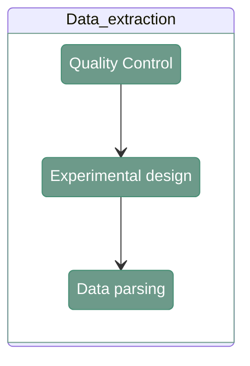
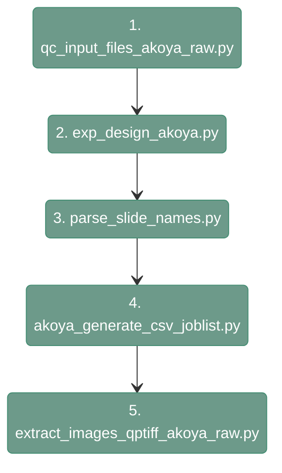

# AKOYA parser

---

<div align="center">


</div>

Data parsing for AKOYA data consist of three main steps. 
The first one is to check the quality of the input data. The second one is to extract the information about the channels from the input.
Last step is to extract the raw data. 

The graph below demonstrates the order to execute the scripts.


<div align="center">


</div>


---

## 1. Quality Control

---

#### **Script 1:** [qc_input_files_akoya_raw.py](src/01_file_parser/qc_input_files_akoya_raw.py)

The script ensures the correctness of the input data. It checks if:

- All detected files are .czi.

- The tabulation of the files is correct.

- The marker names are within expectations.

- All the slides have the same round/versions.

- All the slide/round/versions have the same channels and with the same names.


``` shell
python src/01_file_parser/qc_input_files_akoya_raw.py \
    --input_path <directory> \
    --output_txt <output_txt>
```

`--input_path`
: Path to input directory with the input data (dir). Example: `/path/to/input_data_files_folder`

`--output_txt`
: Path to the output txt where the QC file will be stored (.txt). Example: `/path/to/project_directory/qc_input_files.txt`

The output file is a report thst contains the following information:

```
Check1 - xpd file QC: PASSED.
Check2 - metadata channel names QC: PASSED.
Check3 - raw data QC: PASSED.
Check4 - matching rounds QC: PASSED.
Check5 - cycle consistency QC: PASSED.
Check6 - marker consistency QC: PASSED.
```

If there is a problem at specific checkpoint (e.g. file is incorrectly named), the programme will stop and provide the information about the encountered issue. 

---

## 2. Experimental design

---

#### **Script 2:** [exp_design_akoya.py](src/01_file_parser/exp_design_akoya.py)

This function reads all the input files and generates a map from channel numbers (C0, C1, C2, etc.) to channel names (DAPI, FITC, AF, etc.). 

``` shell
python src/01_file_parser/exp_design_akoya.py \
    --input_path <path_to_files/> \
    --exp_design_rounds <path_to_output_csv/> \
    --exp_design_slides <path_to_output_csv_slides/>
```

`--input_path`
: Path to the parent directory where the input files are stored (dir). Example: `/path/to/data_files`

`--exp_design_rounds`
: Path to output file where the experimental design for the rounds will be saved (.csv). Example: `/path/to/project_directory/experimental_design/exp_design_rounds.csv`

`--exp_design_slides`
: Path to the output file where the experimental design for the slides will be saved (.csv). Example: `/path/to/project_directory/experimental_design/exp_design_slides.csv` 


---

#### **Script 3:** [parse_slide_names.py](src/01_file_parser/parse_slide_names.py)

!!! warning
    Before running this step, you need to manually add column `slide_id`, with the ID name of yur choice,  to */path/to/project_directory/experimental_design/exp_design_slides.csv* file. 
In GUI this information is taken from the user and incorporated into the data directly.

`parse_slide_names` combines information from experimental design files (rounds and slides) into one file

``` shell
python src/01_file_parser/parse_slide_names.py \
    --path_input_exp_design_rounds <path_to_input_csv/> \
    --path_input_exp_design_slides <path_to_input_csv_slides/> \
    --path_output_exp_design_merged <path_to_output_csv/>
```

`--path_input_exp_design_rounds`
: Path to input file with experimetnal design rounds (.csv). Example: `/path/to/project_directory/experimental_design/exp_design_rounds.csv` 

`--path_input_exp_design_slides`
: Path to input file with experimetnal design slides (.csv). Example: `/path/to/project_directory/experimental_design/exp_design_slides.csv` 

`--path_output_exp_design_merged`
: Path to the output CSV where the slides metadata will be stored (.csv). Example: `/path/to/project_directory/experimental_design/exp_design_rounds.csv` 

---

## 3. Data parsing

---

#### **Script 4:** [akoya_generate_csv_joblist.py](src/01_file_parser/akoya_generate_csv_joblist.py)

`akoya_generate_csv_joblist.py` lists all the czi files in the project’s folder and generates a csv file listing all the jobs that need to be run in the next step. 

``` shell
python src/01_file_parser/akoya_generate_csv_joblist.py \
    --path.input.folder <path_to_input_project_folder/> \
    --path.output.folder <path_to_output_tiles/> \
    --path.input.slide.dictionary <path_to_input_slides_dictionary/> \
    --path.exp.design.rounds.file <path_to_input_channel_dictionary/> \
    --user.id <user_id/> \
    --project.id <project_id/> \
    --path.output.csv <path_to_output_csv/>
```

`--path.input.folder`
: Path to the parent directory where the input files are stored (dir). Example: `/path/to/data_files`

`--path.output.folder`
: Path to the output directory where the processed tiles will be saved (dir). Example: `/path/to/project_directory/output_tiles_tiffs`

`--path.input.slide.dictionary`
: Path to input file with experimetnal design slides (.csv). Example: `/path/to/project_directory/experimental_design/exp_design_slides.csv` 

`--path.exp.design.rounds.file`
: Path to input file with experimetnal design rounds (.csv). Example: `/path/to/project_directory/experimental_design/exp_design_rounds.csv` 

`--user.id`
: User identifier (str). Example: `JM` 

`--project.id`
: Project identifier (str). Example: `AKOYA` 

`--path.output.csv`
: Path to output csv (csv). Example: `/path/to/project_directory/data_parsing.csv`


#### **Script 5\*:** [extract_images_qptiff_akoya_raw.py](src/01_file_parser/extract_images_qptiff_akoya_raw.py)

`extract_images_qptiff_akoya_raw.py` reads an input czi given a full path and extracts all the tiles and metadata in a predefined output directory. 

``` shell
python src/01_file_parser/extract_images_qptiff_akoya_raw.py \
    --input_path <path_to_input_data/> \
    --output_folder <path_to_output_tiles/> \
    --input_slide_dictionary <path_to_slide_dictionary/> \
    --exp_design_rounds_file <path_to_channel_dictionary/> \
    --user_id <user_id/> \
    --project_id <project_id/> \
    --n_workers <number_of_workers/>
```

`--input_path`
: Path to input files (dir). Example: `/path/to/data_files`

`--output_folder`
: Path to output tiles (dir). Example: `/path/to/project_directory/output_tiles_tiffs` 

`--input_slide_dictionary`
: Path to input csv with slide names (.csv). Example: `/path/to/project_directory/experimental_design/exp_design_slides.csv` 

`--exp_design_rounds_file`
: Path to experimental design file rounds (.csv). Example: `/path/to/project_directory/experimental_design/exp_design_rounds.csv` 

`--user_id`
: User identifier (str). Example: `JM`

`--project_id`
: Project identifier (str). `Example: PROJECT_COMET`

`--n_workers`
: Maximum pending parallel channel writes; reads are sequential (default 4). Example: `4`
---