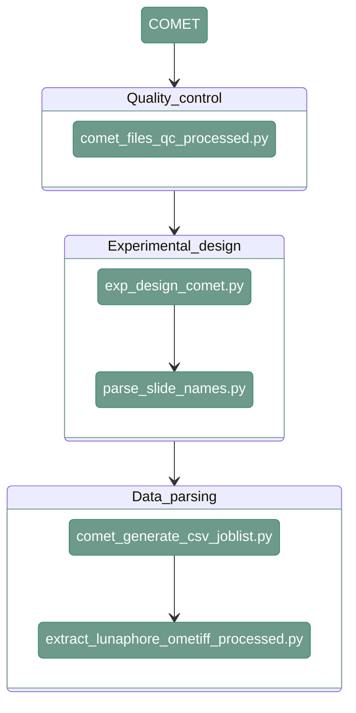

# Data parsing - COMET
---

<div align="center">


</div>

Data parsing for COMET data consist of three main steps. 
The first one is to check the quality of the input data. The second one is extracting the information about the channels from the input.
Last step is to extract the raw data. 

---

## 1. Tiles QC

---
 
#### **Script 1:**  [comet_files_qc_processed.py](https://github.com/antoranzlab/DISSCOvery/blob/main/src/01_file_parser/comet_files_qc_processed.py)


The script ensures the correctness of the input data. It checks if:

- The .xml jobfile exists for all slides

- The channel names are within expectations

- The ome.tiff file exists

- The markers in the metadata and the image are the same

- All the slides have the same rounds/markers

```
python src/01_file_parser/comet_files_qc_processed.py \
    --input_path <directory> \
    --output_txt <output_txt>
```

`--input_path`
: Path to input directory with the input data (dir). Example: `/path/to/input_data` 

`--output_txt`
: Path to the output txt where the QC file will be stored (.txt). Example: `/path/to/project_directory/qc_input_files.txt` 

The output file is a report thst contains the following information:
```
Check1 - File format QC: PASSED.
Check2 - File tabulation QC: PASSED.
Check3 - Round naming QC: PASSED.
Check4 - Version naming QC: PASSED.
Check5 - Channel naming QC: PASSED.
Check6 - Round/Versions per slide QC: PASSED.
Check7 - Channels per Slide/Round/Version QC: PASSED.
```

If there is a problem at specific checkpoint (e.g. file is incorrectly named), the program will stop and provide the information about the encountered issue. Example:

```
Check1 - xml file QC: PASSED.
Check2 - raw data QC: PASSED.
Check3 - Number of cycles per slide QC: PASSED.
Check4 - Cycle folder nomenclature QC: PASSED.
Check5 - Tiff file nomenclature QC: PASSED.
Check6 - Channel names QC: PASSED.
Check7.a - Matching metadata and files QC: PASSED.
Check7.b - Matching files and metadata QC: NOT PASSED.
Condition: missing metadata in: 2025-BM-fin
```

---

## 2. Experimental design

---

#### **Script 1:**  [exp_design_comet.py](https://github.com/antoranzlab/DISSCOvery/blob/main/src/01_file_parser/exp_design_comet.py)

This function reads all the input files and generates a map from channel numbers (C0, C1, C2, etc.) to channel names (DAPI, FITC, AF, etc.). 

!!! warning
    Marker names can contain alphanumeric characters and "-". Using other signs may cause problems in later stages of the image preprocessing. 

``` shell
python src/01_file_parser/exp_design_comet.py \
    --input_path <path_to_files/> \
    --exp_design_rounds <path_to_output_csv/> \
    --exp_design_slides <path_to_output_csv_slides/>
```

`--input_path`
: Path to the parent directory where the input files are stored (dir). Example: `/path/to/input_data`   

`--exp_design_rounds`
: Path to output file where the experimental design for the rounds will be saved (.csv). Example: `/path/to/project_directory/experimental_design/exp_design_rounds.csv`     

`--exp_design_slides`
: Path to the output file where the experimental design for the slides will be saved (.csv). Example: `/path/to/project_directory/experimental_design/exp_design_slides.csv` 


---

#### **Script 2:**  [parse_slide_names.py](https://github.com/antoranzlab/DISSCOvery/blob/main/src/01_file_parser/parse_slide_names.py)

!!! warning
    Before running this step, you need to manually add column `slide_id`, with the ID name of yur choice,  to */path/to/project_directory/experimental_design/exp_design_slides.csv* file. 
In GUI this information is taken from the user and incorporated into the data directly.

`parse_slide_names` combines information from experimental design files (rounds and slides) into one file

``` shell
python src/01_file_parser/parse_slide_names.py \
    --path_input_exp_design_rounds <path_to_input_csv/> \
    --path_input_exp_design_slides <path_to_input_csv_slides/> \
    --path_output_exp_design_merged <path_to_output_csv/>
```

`--path_input_exp_design_rounds`
: Path to input file with experimetnal design rounds (.csv). Example: `/path/to/project_directory/experimental_design/exp_design_rounds.csv` 

`--path_input_exp_design_slides`
: Path to input file with experimetnal design slides (.csv). Example: `/path/to/project_directory/experimental_design/exp_design_slides.csv`

`--path_output_exp_design_merged`
: Path to the output CSV where the slides metadata will be stored (.csv). Example: `/path/to/project_directory/experimental_design/exp_design_rounds.csv`

---

## 3. Data parsing

---

#### **Script 1:**  [comet_generate_csv_joblist.py](https://github.com/antoranzlab/DISSCOvery/blob/main/src/01_file_parser/comet_generate_csv_joblist.py)


`comet_generate_csv_joblist.py` lists all the czi files in the project’s folder and generates a csv file with all the jobs that need to be run in the next step. 

```
python src/01_file_parser/comet_generate_csv_joblist.py \
    --path.input.folder <path_to_input_project_folder/> \
    --path.output.folder <path_to_output_tiles/> \
    --path.input.slide.dictionary <path_to_input_slides_dictionary/> \
    --path.exp.design.rounds.file <path_to_input_channel_dictionary/> \
    --user.id <user_id/> \
    --project.id <project_id/> \
    --path.output.csv <path_to_output_csv/>
```

`--path.input.folder`
: Path to the parent directory where the input files are stored (dir). Example: `/path/to/input_data` 

`--path.output.folder`
: Path to the output directory where the processed tiles will be saved (dir). Example: `/path/to/project_directory/output_tiles_tiffs`

`--path.input.slide.dictionary`
: Path to input file with experimetnal design slides (.csv). Example: `/path/to/project_directory/experimental_design/exp_design_slides.csv` 

`--path.exp.design.rounds.file`
: Path to input file with experimetnal design rounds (.csv). Example: `/path/to/project_directory/experimental_design/exp_design_rounds.csv`

`--user.id`
: User identifier (str). Example: `JM` 

`--project.id`
: Project identifier (str). Example: `PROJECTCOMET`

`--path.output.csv`
: Path to output csv (csv). Example: `/path/to/project_directory/data_parsing.csv`

---

#### **Script 2:**  [extract_lunaphore_ometiff_processed.py](https://github.com/antoranzlab/DISSCOvery/blob/main/src/01_file_parser/extract_lunaphore_ometiff_processed.py)

`extract_lunaphore_ometiff_processed.py` reads an input czi given a full path and extracts all the tiles and metadata in a predefined directory. 

```
python src/01_file_parser/extract_lunaphore_ometiff_processed.py \
    --input_directory <path_to_input_data/> \
    --output_directory <path_to_output_tiles/> \
    --slide_dictionary_file <path_to_slide_dictionary/> \
    --exp_design_rounds_file <path_to_channel_dictionary/> \
    --user_id <user_id/> \
    --project_id <project_id/> \
    --rounds <rounds/> \*
    --n_workers <n_workers/> \
```

`--input_directory`
: Path to input files (dir). Example: `/path/to/data_files`

`--output_directory`
: Path to output tiles (dir). Example: `/path/to/project_directory/output_tiles_tiffs`

`--slide_dictionary_file` 
: Path to input csv with slide names (.csv). Example: `/path/to/project_directory/experimental_design/exp_design_slides.csv`

`--exp_design_rounds_file` 
: Path to experimental design file rounds (.csv). Example: `/path/to/project_directory/experimental_design/exp_design_rounds.csv`

`--user_id`
: User identifier (str). Example: `JM`

`--project_id`
: Project identifier (str). `Example: COMET`

`--rounds`*
: Optional parameter, rounds names to extract (str). If not provided all rounds are extracted. Example: `R01,R02,R03`

`--n_workers`
: Maximum pending parallel channel writes; reads are sequential (default 4). Example: `4`

---