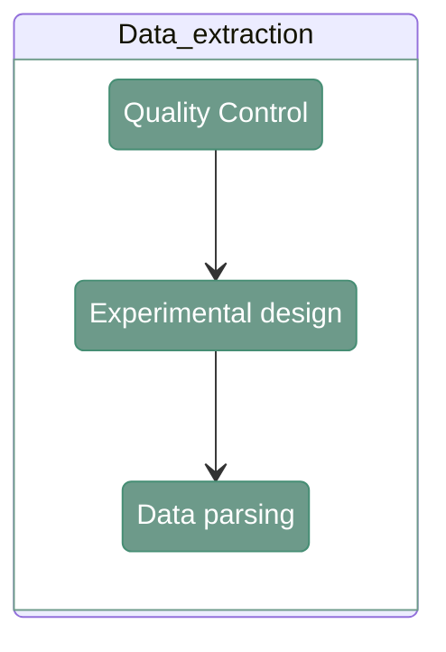
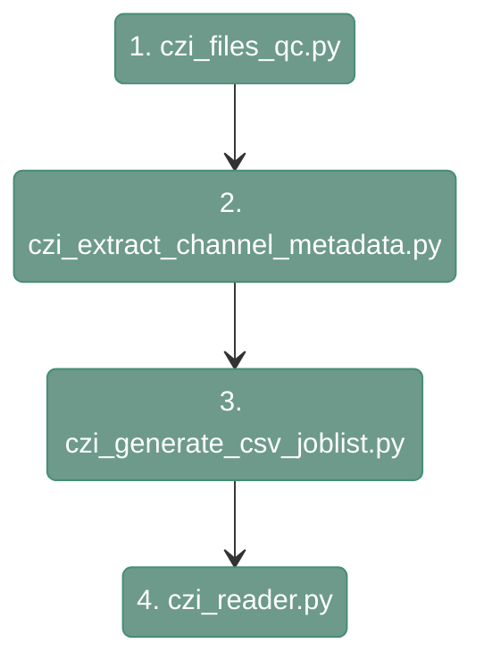

# MILAN parser

---

<div align="center">


</div>

Data parsing for MILAN data consist of three main steps. 
The first one is quality control of the input data. The second one is extracting the information about the channels from the input files.
In this step MILAN preprocessing requires to provide some information about the experimental design by the user. 
In the DISSCOvery app, this is done in GUI. However, when running the code manually the user themselves must prepare the file *exp_design_rounds.csv*.
More detail about this file here.
Last step is raw data extraction.

The graph below demonstrates the execution order of the scripts.

<div align="center">



</div>

---

## 1. Raw tiles QC

---

#### **Script 1:** [czi_files_qc.py](https://gitlab.kuleuven.be/u0172795/disscovery/-/blob/main/src/01_file_parser/czi_files_qc.py?ref_type=heads)

The script ensures the correctness of the input data. It checks if:

- All detected files are `.czi`. 

- The tabulation of the files is correct. 

- Marker names are within expectations. 

- All slides have the same round/versions. 

- All slides/rounds/versions have the same channels and the same names. 

``` shell
python src/01_file_parser/czi_files_qc.py \
  --directory <directory> \
  --output_txt <output_txt>
```

`--directory`
: Path to the parent directory containing raw `.czi` files. Example: `/path/to/czi_data_files_folder`                          

`--output_txt`
: Path to the output `.txt` file where the QC information will be stored. Example: `/path/to/project_directory/input_qc.txt`

The output file is a report containing the following information:
```
Check1 - File format QC: PASSED.
Check2 - File tabulation QC: PASSED.
Check3 - Round naming QC: PASSED.
Check4 - Version naming QC: PASSED.
Check5 - Channel naming QC: PASSED.
Check6 - Round/Versions per slide QC: PASSED.
Check7 - Channels per Slide/Round/Version QC: PASSED.
```

If there is a problem at specific checkpoint (e.g. file is incorrectly named), the programme will stop and provide the information about the encountered issue. Example:

```
Check1 - File format QC: PASSED.
Check2 - File tabulation QC: PASSED.
Check3 - File tabulation mismatch: /benchmarking_MILAN/R06/file_name.czi
```

---

## 2. Experimental design

---

#### **Script 2:** [czi_extract_channel_metadata.py](https://gitlab.kuleuven.be/u0172795/disscovery/-/blob/main/src/01_file_parser/czi_extract_channel_metadata.py?ref_type=heads)

This function reads all the .czi files in the input directory (folder and subfolders) and generates a map from channel numbers (C0, C1, C2, etc.) to channel names (DAPI, FITC, AF, etc.)

``` shell
python src/01_file_parser/czi_extract_channel_metadata.py \
  --directory <path_to_czis/> \
  --output_csv_channels <path_to_output_csv/> \
  --output_csv_slides <path_to_output_csv_slides/>
```

`--directory`
: Path to the parent directory containing raw czi. Example: `/path/to/czi_data_files_folder`                                                            

`--output_csv_channels`
: Path to the output `.csv` where the channels metadata will be stored. Example: `/path/to/project_directory/experimental_design/channel_names.csv` 

`--output_csv_slides`
: Path to the output `.csv` where the slides metadata will be stored. Example: `/path/to/project_directory/experimental_design/exp_design_slides.csv` 

Output_csv_channels has the following columns:

- `channel_id` - channel name (DAPI, FITC, etc.); FITC_AF/AF_FITC is converted AF
 
- `channel_number` - channel number (C0, C1, C2, etc.)

- `czi_file` - full path to the `.czi` file

- `basename` basename(czi_file)

- `slide_id` - identifier for the slide using the naming convention

- `round_number` - identifier for the round

- `version_id` - identifier for the version

- `project_id` - identifier for the project

- `user_id` - identifier for the user who acquired the data

!!! warning
    When running the pipeline manually, after obtaining the *exp_design_slides.csv* you need to add there and additional columns, `slide_id`, that contains slide names 

---

## 3. Data parsing

---

#### **Script 3:** [czi_generate_csv_joblist.py](https://gitlab.kuleuven.be/u0172795/disscovery/-/blob/main/src/01_file_parser/czi_generate_csv_joblist.R?ref_type=heads)

In this step, `.czi`'s files are processed to extract individual tiles and the corresponding metadata. 
`czi_generate_csv_joblist.py` lists all the czi files in the project’s folder and generates a `.csv` file containing all the jobs that need to be run in the next step.

``` shell
python src/01_file_parser/czi_generate_csv_joblist.py \
  --path.input.folder <path_to_input_project_folder/> \
  --path.input.channel.dictionary <path_to_input_channel_dictionary/> \
  --path.output.folder <path_to_output_tiles/> \
  --path.output.csv <path_to_output_csv_joblist/>
    
```

`--path.input.folder`
: Path to the parent directory containing raw czi files. Example: `/path/to/data_files`                                                                     

`--path.input.channel.dictionary`
: Path to the `.csv` file mapping numeric (C0, C1, ...) to alphabetic (DAPI, FITC, ...) channel names. Example: `/path/to/project_directory/channel_names.csv` 

`--path.output.folder`
: Path to the output directory where the processed tiles will be saved. Example: `/path/to/project_directory/output_tiles_tiffs`                      

`--path.output.csv`
: Path to the output `.csv` file where the list of jobs will be stored. Example: `/path/to/project_directory/czi_extraction_csv.csv`                      


#### **Script 4\*:** [czi_reader.py](src/01_file_parser/czi_reader.py)


`czi_reader.py` reads an input czi given a full path and extracts all the tiles and metadata in a predefined output directory. 

``` shell
python src/01_file_parser/czi_reader.py \
    --imfilename <path_to_input_data/> \
    --channel_names_dictionary <path_to_channel_dictionary/> \
    --output_folder <path_to_output_tiles/> \
    --n_workers <number_of_workers/>
```

`--imfilename` 
: Path to the CZI file for the project/experiment (.czi). Example: `/path/to/data_files/subfolder/czi_file.czi`                                                    

`--channel_names_dictionary`
: Path to the CSV file mapping numeric (C0, C1, ...) to alphabetic (DAPI, FITC, ...) channel names (.csv). Example: `/path/to/project_directory/channel_names.csv` 

`--output_folder`
: Path to the output directory where the raw tiles will be saved (.tiff). Example: `/path/to/project_directory/output_tiles_tiffs`                                 

`--n_workers`
: number of processes used to read/write tiles concurrently. Defaults to 5. Example: `5` 
---