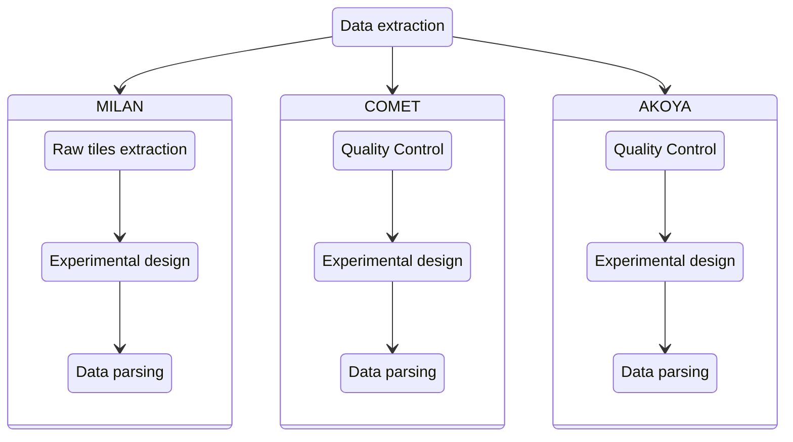

# File parsing description
<h1 align="center"> Files Preparation </h1>

---

```mermaid
stateDiagram-v2
    Data_extraction --> MILAN
    Data_extraction --> COMET
    Data_extraction --> AKOYA
    Data_extraction: Data extraction
    
    state MILAN{
      MILAN_raw --> MILAN_exp_design
      MILAN_raw: Raw tiles extraction
      MILAN_exp_design: Experimental design
      MILAN_exp_design --> MILAN_parsing
      MILAN_parsing: Data parsing
    }
    
    state COMET{
      COMET_QC --> COMET_exp_design
      COMET_QC: Quality Control
      COMET_exp_design: Experimental design
      COMET_exp_design --> COMET_parsing
      COMET_parsing: Data parsing
    }
    
    state AKOYA{
      AKOYA_QC --> AKOYA_exp_design
      AKOYA_QC: Quality Control
      AKOYA_exp_design: Experimental design
      AKOYA_exp_design --> AKOYA_parsing
      AKOYA_parsing: Data parsing
    }
    


```

