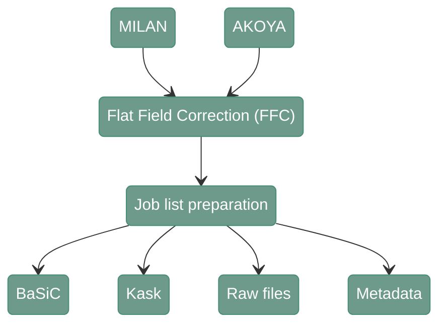

# Flat Filed Correction (FFC) - Overview

---

<div align="center">



</div>

---

Flat Field Correction (FFC) removes the vignetting from the images, which is the difference in the illumination on the image, typically visible as shading that increases at the edges of the image. . 
By default COMET and AKOYA provides already partially preprocessed data and don't require FFC. 
However in case one uses raw data as input for these platforms, we provide also suggestion on how to perform FFC on such data.
There are three possibilites that can be considered: raw tiles (no FFC needed), method from Kask et al (https://onlinelibrary.wiley.com/doi/10.1111/jmi.12404) and BaSiC (https://www.nature.com/articles/ncomms14836)
As a result of the benchmarking study, we have a preferred FFC method per technology and channel, presented in the table below. 


| Technology | Channel  | Background | Foreground | Method |
|:----------:|:--------:|:----------:|:----------:|:------:|
|   MILAN    |   DAPI   |    RAW     |    RAW     |  RAW   |
|   MILAN    |   FITC   |   BASIC    |    RAW     | BASIC  |
|   MILAN    |    AF    |    KASK    |    KASK    |  KASK  |
|   MILAN    |  TRITC   |   BASIC    |   BASIC    | BASIC  |
|   MILAN    |   Cy5    |   BASIC    |   BASIC    | BASIC  |
|   COMET    |   DAPI   |    KASK    |    KASK    |  KASK  |
|   COMET    |  TRITC   |    KASK    |    KASK    |  KASK  |
|   COMET    |   Cy5    |    KASK    |    KASK    |  KASK  |
|  MACSIMA   |   DAPI   |    RAW     |   BASIC    | BASIC  |
|  MACSIMA   |   FITC   |   BASIC    |   BASIC    | BASIC  |
|  MACSIMA   |   APC    |   BASIC    |   BASIC    | BASIC  |
|  MACSIMA   |    PE    |    RAW     |    RAW     |  RAW   |
|   AKOYA    |   DAPI   |   BASIC    |   BASIC    | BASIC  |
|   AKOYA    | ATTO550  |   BASIC    |   BASIC    | BASIC  |
|   AKOYA    |  AF750   |   BASIC    |   BASIC    | BASIC  |
|   AKOYA    |   Cy5    |   BASIC    |   BASIC    | BASIC  |


The method from Kask et al requires additional preparation of the input data described further on the subsection devoted to this method. 
If a technology/channel is not included in the list, BASIC is applied as default. 

---

## 1. Job list

---

#### **Script 1:** [FFC_list_jobs.py](https://gitlab.kuleuven.be/u0172795/disscovery/-/blob/main/src/02_FFC/FFC_list_jobs.py?ref_type=heads) 

Regardless of the chosen FFC method, starting the process require generating the job list file first. 
It embraces all output possibilities, except for processing metadata files.

``` shell
python src/02_FFC//FFC_list_jobs.py \
    --input_path_tiles {params.tiles_dir} \
    --input_path_meta {params.tiles_dir} \
    --input_path_masks {params.path_masks} \
    --mask_pixel_size {params.pixel_size} \
    --input_method_dictionary {params.method_dict} \
    --acquisition_technology {params.technology} \
    --output_folder_corr {params.output_corr} \
    --output_folder_templates {params.output_templates} \
    --output_path_csv {params.output_csv} \
    --output_path_csv_metadata {params.output_meta} \
```

`--input_path_tiles`
: Path to the parent directory where the tiles are stored (dir). Example: `/path/to/project_directory/output_tiles_tiffs`

`--input_path_meta`
: Path to the parent directory where the metadata is stored (dir). Usually the same folder as the input_path_tiles. Example: `/path/to/project_directory/output_tiles_tiffs`

`--input_path_masks`
: Path to the parent directory where the masks will be stored (dir). Example: `/path/to/project_directory/output_FFC_kask_masks`

`--mask_pixel_size`
: Pixel size used for the masks (numeric). Example: `2.6`

`--input_method_dictionary`
: Path to the CSV with the dictionary containing FFC method per technology/channel (.csv). Example: `02_FFC/technology_channel_method_dictionary.csv`

`--acquisition_technology`
: Used technology (str). Example: `MILAN`

`--output_folder_corr`
: Path to the folder where the FFC tiles will be stored (dir). Example: `/path/to/project_directory/output_FFC_corrected`

`--output_folder_templates`
: Path to the folder where the FFC templates will be stored (dir). Example: `/path/to/project_directory/output_FFC_templates`

`--output_path_csv`
: Path to the CSV where the list of jobs will be saved (.csv). Example: `/path/to/project_directory/FFC_job_list.csv`

`--output_path_csv_metadata`
: Path to the CSV where the jobs list to copy the metadata will be saved (.csv). Example: `/path/to/project_directory/FFC_job_list_metadata.csv`

---