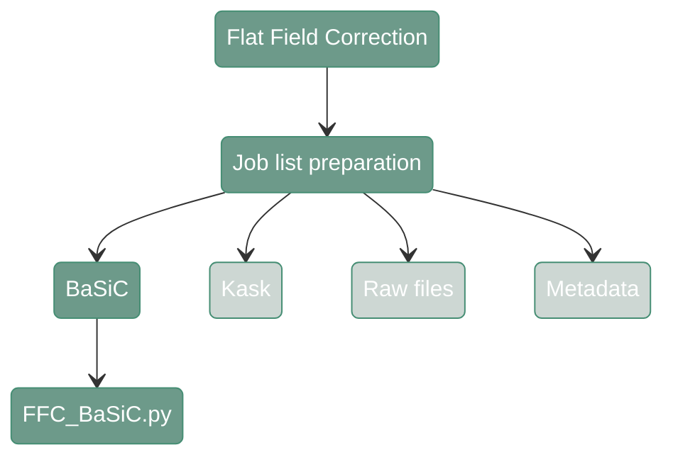

# Flat Filed Correction - BaSiC

---
<div align="center">



</div>

---

#### **Script 1:** [FFC_BaSiC.py](https://github.com/antoranzlab/DISSCOvery/blob/main/src/02_FFC/FFC_BaSiC.py)  


This function performs FFC using [BaSiC](https://www.nature.com/articles/ncomms14836) method. It takes as an input a path to a folder with tiles and returns the same tiles without vignetting effect. It also creates QC plots. 

!!! warning
    This function requires a library (basicpy) that is not compatible with the typical TensorFlow installation. 
    Therefore, it needs its own python environment. It is compatible with GPU acceleration.


``` shell
python src/02_FFC/02_FFC_BaSiC.py \
    --in_path {params.tile} \
    --channel {params.channel} \
    --out_path_corr {params.out_corr} \
    --out_path_templates {params.out_temp} \
    --n_write_workers {params.n_cores} \
    --device {params.device} \
    --n_fit_images {params.fit} \
    --seed {params.n_cores} \
```

`--in_path`
: Path to the input directory where the tiles are stored (dir). Example: `/path/to/project_directory/output_tiles_tiffs/test_R00_V01_BENCHMARK_ND`

`--channel`
: Channel name (str). Example: `DAPI`

`--out_path_corr`
: Path to the output directory where the corrected tiles will be stored (dir). Example: `/path/to/project_directory/output_FFC_corrected/test_R00_V01_BENCHMARK_ND`

`--out_path_templates`
: Path to the output directory where the correction templates will be stored (dir). Example: `/path/to/project_directory/output_FFC_templates/test_R00_V01_BENCHMARK_ND`

`--n_write_workers`
: Number of workers used for writing the corrected tiles (int). Example: `4`

`--device`
: Device used for computation, e.g. "cuda", "cpu", "none" (str). Example: `cuda`

`--n_fit_images`
: Number of images used to fit the flat-field correction templates (int). Example: `100`

`--seed`
: Random seed used for reproducibility (int). Example: `42`
---

