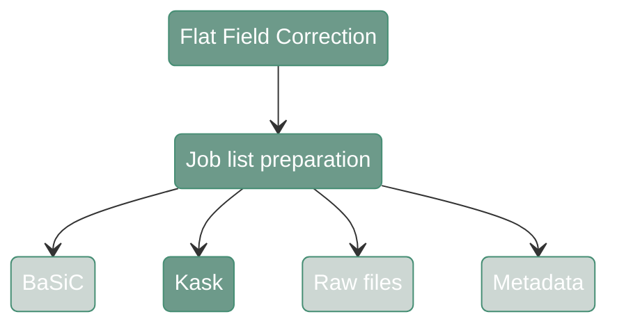
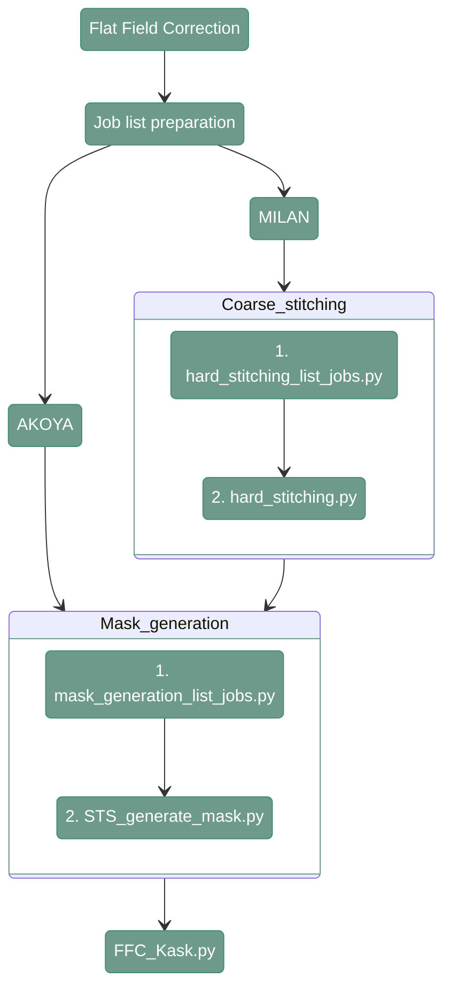

# Flat Filed Correction - Kask

---
<div align="center">



</div>

---

## 1. Input files preparation

---

This function performs FFC with the method described by [Kask et al. (2016)](https://onlinelibrary.wiley.com/doi/10.1111/jmi.12404). Before running the main script that reduces vignetting, it is necessary to prepare all the input files required for this algorithm. 
Therefore, first the course stitching and tissue masks have to be generated.  

---

<div align="center">


</div>

---

#### **Coarse stitching scripts:**
   - [hard_stitching_list_jobs.py](https://github.com/antoranzlab/DISSCOvery/blob/main/src/03_hard_stitching/hard_stitching_list_jobs.py) 
   - [hard_stitching.py](https://github.com/antoranzlab/DISSCOvery/blob/main/src/03_hard_stitching/hard_stitching.py)
   
#### **Mask generation scripts:**
   - [mask_generation_list_jobs.py](https://github.com/antoranzlab/DISSCOvery/blob/main/src/04_STS/mask_generation_list_jobs.py) 
   - [STS_generate_mask.py](https://github.com/antoranzlab/DISSCOvery/blob/main/src/04_STS/STS_generate_mask.py)


---

## 2. FFC Kask

#### **Script 1:** [FFC_Kask.py](https://github.com/antoranzlab/DISSCOvery/blob/main/src/02_FFC/FFC_Kask.py)

``` shell
python src/02_FFC/FFC_Kask.py \
    --input_images <path_to_tiles/> \
    --input_metadata <path_to_metadata/> \
    --input_mask <path_to_mask/> \
    --pixel_size <pixel_size_in_mask/> \
    --channel <channel_identifier/> \
    --output_path_corrected_tiles <path_to_corrected_tiles/> \
    --output_path_templates <path_to_templates/> \
    --n_cores <number_of_cores/>
```

`--input_images`
: Path to the input directory where the raw tiles are stored (dir). Example: `/path/to/project_directory/output_tiles_tiffs/test_R00_V01_BENCHMARK_ND`

`--input_metadata`
: Path to the CSV where the metadata is stored (.csv). Example: `/path/to/project_directory/output_tiles_tiffs/test_R00_V01_BENCHMARK_ND/test_R00_V01_BENCHMARK_ND.csv`

`--input_mask`
: Path to the TIFF file where the mask is stored (.tiff). Example: `/path/to/project_directory/output_FFC_kask_masks/test/test_R00_V01_BENCHMARK_ND_DAPI.tiff`

`--pixel_size`
: Pixel size used for the mask (numeric). Example: `2.6`

`--channel`
: Channel identifier (str). Example: `DAPI`

`--output_path_corrected_tiles`
: Path to the output directory where the corrected tiles will be stored (dir). Example: `/path/to/project_directory/output_FFC_corrected/test_R00_V01_BENCHMARK_ND`

`--output_path_templates`
: Path to the output directory where the correction templates will be stored (dir). Example: `/path/to/project_directory/output_FFC_templates/KASK/test_R00_V01_BENCHMARK_ND`

`--n_cores`
: Number of cores to use (numeric). Example: `10`


---

