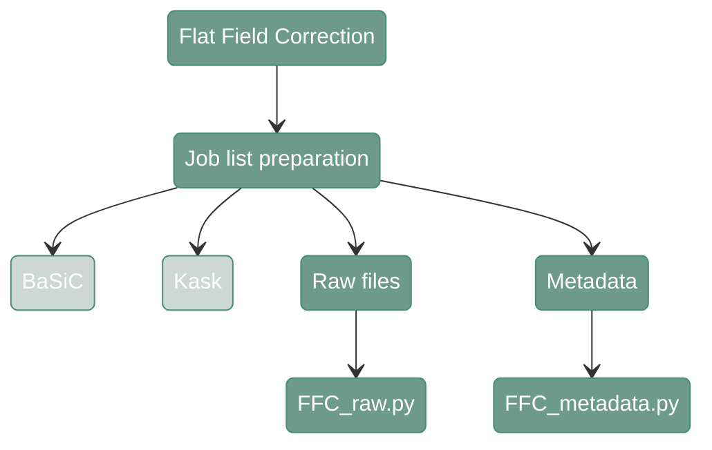

# Flat Filed Correction - Metadata &  Raw tiles

---
<div align="center">



</div>

---

## 1. FFC Raw


#### **Script 1:** [FFC_raw.py](https://github.com/antoranzlab/DISSCOvery/blob/main/src/02_FFC/FFC_raw.py)


This function copies the raw tiles to the output folder


``` shell
python src/02_FFC/FFC_raw.py \
    --input_images <path_to_tiles/> \
    --channel <channel_identifier/> \
    --output_path_corrected_tiles <path_to_corrected_tiles/> \
    --skip_existing <skip_existing_results/>
```

`--input_images`
: Path to the input directory where the raw tiles are stored (dir). Example: `/path/to/project_directory/output_tiles_tiffs/test_R00_V01_BENCHMARK_ND`

`--channel`
: Channel identifier (str). Example: `DAPI`

`--output_path_corrected_tiles`
: Path to the output directory where the corrected tiles will be stored (dir). Example: `/path/to/project_directory/output_FFC_corrected/test_R00_V01_BENCHMARK_ND`

`--skip_existing`
: Whether to skip already existing results (str). Example: `False`


---

## 2. FFC metadata

---

!!! note
    While FFC raw is not required for all platforms, the metadata scripts needs to be run regardless of used technology

#### **Script 2:** [FFC_metadata.py](https://github.com/antoranzlab/DISSCOvery/blob/main/src/02_FFC/FFC_metadata.py)

This function copies the metadata from the raw tiles to the output folders.

``` shell
python src/02_FFC/FFC_metadata.py \
    --input_metadata <path_to_input_metadata/> \
    --output_metadata <path_to_output_metadata/> 
```

`--input_metadata`
: Path to the input CSV file with the metadata. For example: `path/to/project_directory/output_tiles_tiffs/test_R00_V01_BENCHMARK_ND/test_R00_V01_BENCHMARK_ND.csv`

`--output_metadata`
: Path to the output CSV file with the metadata. For example: `path/to/project_directory/output_FFC_corrected/test_R00_V01_BENCHMARK_ND/test_R00_V01_BENCHMARK_ND.csv`

---

