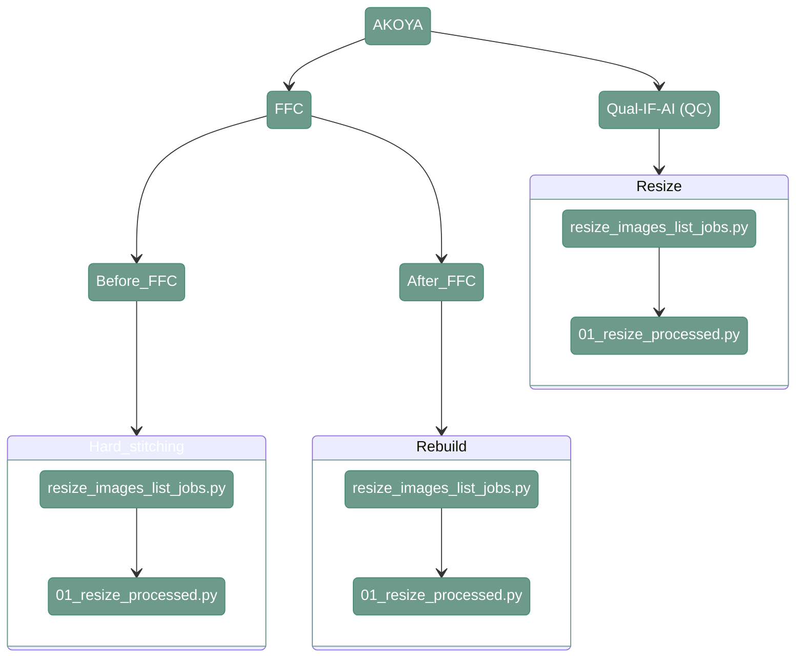

# Resize, Rebuild - AKOYA

---

## 1. Overview

---

<div align="center">



</div>

---
## 2. Hard stitching scripts

#### **Script 1:** [hard_stitching_list_jobs.py](https://github.com/antoranzlab/DISSCOvery/blob/main/src/03_hard_stitching/hard_stitching_list_jobs.py) 

This script generates coarse stitched images from the individual tiles. It needs to be run before FFC

``` shell
python src/03_hard_stitching/hard_stitching_list_jobs.py \
    --input_path_tiles <path_to_tiles/> \
    --input_path_meta <path_to_metadata/> \
    --output_folder <path_to_output/> \
    --output_path_csv <path_to_joblist.csv> \
    --output_pixel_size <pixel_size/> \
    --only_dapi <only_dapi/> \
    --skip_existing <skip_existing_results/>
```

`--input_path_tiles`
: Path to the directory containing the input tiles (dir). Example: `/path/to/project_directory/output_tiles_tiffs`

`--input_path_meta`
: Path to the directory containing the metadata associated with the input tiles (dir). Example: `/path/to/project_directory/output_tiles_tiffs`

`--output_folder`
: Path to the output directory where the hard-stitching results will be stored (dir). Example: `/path/to/project_directory/hard_stitching_FFC`

`--output_path_csv`
: Path to the CSV file where the generated hard-stitching job list will be stored (.csv). Example: `/path/to/project_directory/hard_stitching_FFC_job_list.csv`

`--output_pixel_size`
: Pixel size to use for the hard stitching, 2.6 for FFC Kask or STS, 0.65 for Qual-IF-AI (numeric). Example: `2.6`

`--only_dapi`
: Whether to generate hard-stitching jobs only for the DAPI channel (bool). Example: `True`

`--skip_existing`
: Whether to skip already existing results (bool). Example: `False`                                                                                                                                                              |

!!! warning
    Make sure you are providing the proper pixel size, the models used later for Kask and STS are trained on a different resolution then the Qual-IF-AI model. 
    Using incorrect pixel size may impact the results

----

#### **Script 2:** [hard_stitching.py](https://github.com/antoranzlab/DISSCOvery/blob/main/src/03_hard_stitching/hard_stitching.py) 

This function generates a hard stitched image.

``` shell
python src/03_hard_stitching/hard_stitching.py \
    --input_tiles <path_to_tiles/> \
    --input_meta <path_to_metadata/> \
    --output_folder <path_to_output/> \
    --conversion_factor <conversion_factor/> \
    --only_dapi <only_dapi/> \
    --skip_existing <skip_existing_results/>
```

`--input_tiles`
: Path to the directory containing the input tiles (dir). Example: `/path/to/project_directory/output_tiles_tiffs/BM_R00_V01_BENCHMARK_ND`

`--input_meta`
: Path to the CSV file containing the tile metadata (.csv). Example: `/path/to/project_directory/output_tiles_tiffs/BM_R00_V01_BENCHMARK_ND/full_BM_R00_V01_BENCHMARK_ND_meta.csv`

`--output_folder`
: Path to the folder where the hard stitched images will be stored (dir). Example: `/path/to/project_directory/hard_stitching_FFC/BM`

`--conversion_factor`
: Conversion factor for downscaling (numeric), 4 for STS or Kask, 1 for QUALIFAI. Example: `4`

`--only_dapi`
: Whether to process only the DAPI channel (bool). Example: `True`

`--skip_existing`
: Whether to skip already existing results (bool). Example: `False`


!!! note
    The conversion factor is automatically calculated when running job list script and is stored in the generated csv file
---

## 2. Rebuild scripts

----

#### **Script 1:** [rebuild_preprocessed_ffc_akoya_list_jobs.py](https://github.com/antoranzlab/DISSCOvery/blob/main/src/03_hard_stitching/rebuild_preprocessed_ffc_akoya_list_jobs.py) 

This function lists all the folders in the input directory and generates a csv with the list of jobs that have to be run for coarse stitching. 
Images from AKOYA needs rebuild after FFC is done

``` shell
python src/03_hard_stitching/rebuild_preprocessed_ffc_akoya_list_jobs.py \
    --input_path_tiles <path_to_tiles/> \
    --input_path_meta <path_to_metadata/> \
    --output_folder <path_to_output/> \
    --output_path_csv <path_to_joblist.csv> \
    --output_pixel_size <output_pixel_size/>
```

`--input_path_tiles`
: Path to the directory containing the input FFC-corrected tiles (dir). Example: `/path/to/project_directory/output_FFC_corrected
`
`--input_path_meta`
: Path to the directory containing the metadata associated with the input tiles (dir). Example: `/path/to/project_directory/output_FFC_corrected`

`--output_folder`
: Path to the output directory where the rebuilt images will be stored (dir). Example: `/path/to/project_directory/output_processed`

`--output_path_csv`
: Path to the CSV file where the generated rebuild job list will be stored (.csv). Example: `/path/to/project_directory/rebuild_job_list.csv`

`--output_pixel_size`
: Pixel size of the input images used for the rebuild (numeric). Example: `0.5`

---

#### **Script 2:** [01_rebuild_after_ffc.py](https://github.com/antoranzlab/DISSCOvery/blob/main/src/03_hard_stitching/01_rebuild_after_ffc.py) 

This function generates a rescaled, re-nomalized, 8-bit image.

``` shell
python src/03_hard_stitching/01_rebuild_after_ffc.py \
    --input_tiles <path_to_tiles/> \
    --input_metadata <path_to_metadata/> \
    --output_folder <path_to_output/> \
    --conversion_factor <conversion_factor/> \
    --skip_existing <skip_existing_results/>
```

`--input_tiles`
: Path to the directory containing the FFC-corrected tiles to be rebuilt (dir). Example: `/path/to/project_directory/output_FFC_corrected/test_R01_V01_BM_u1`

`--input_metadata`
: Path to the CSV file containing the metadata associated with the input tiles (.csv). Example: `/path/to/project_directory/output_FFC_corrected/test_R01_V01_BM_u1.csv`

`--output_folder`
: Path to the output directory where the rebuilt images will be stored (dir). Example: `/path/to/project_directory/output_processed/test_R01_V01_BM_u1`

`--conversion_factor`
: Conversion factor used to rescale the input tiles during rebuilding (numeric). Example: `1`

`--skip_existing`
: Whether to skip already existing results (bool). Example: `False`

---


## 3. Resize scripts

----

#### **Script 1:** [resize_images_list_jobs.py](https://github.com/antoranzlab/DISSCOvery/blob/main/src/03_hard_stitching/resize_images_list_jobs.py) 

This function lists all the folders in the input directory and generates a csv with the list of jobs that have to be run for coarse stitching. 
Images from AKOYA needs to be resized for QUALIFAI.

``` shell
python src/03_hard_stitching/hard_stitching_list_jobs.py \
    --input_path_images <path_to_images/> \
    --output_folder <path_to_output/> \
    --output_path_csv <path_to_joblist.csv> \
    --output_pixel_size <output_pixel_size/> \
    --input_pixel_size <input_pixel_size/>
```


`--input_path_images`
: Path to the directory containing the input images (dir). Example: `path/to/project_directory/output_processed` 

`--output_folder`
: Path to output path to save images (dir). Example:  `path/to/project_directory/resized_images` (STS) or `path/to/project_directory/resized_images_QC` (for QUALIFAI)

`--output_path_csv`
: Path to the CSV file where the generated hard-stitching job list will be stored (.csv). Example: `/path/to/project_directory/resize_STS_job_list.csv`

`--output_pixel_size`
: Pixel size input images (numeric). Example: `2.6` (for STS) or `0.65` (for QUALIFAI).

`--input_pixel_size`
: Pixel size input images (numeric). Example: `0.5` (AKOYA)


---

#### **Script 2:** [01_resize_processed.py](https://github.com/antoranzlab/DISSCOvery/blob/main/src/03_hard_stitching/01_resize_processed.py) 

This function generates a rescaled, re-normalized, 8-bit image.

``` shell
python src/03_hard_stitching/01_resize_processed.py \
    --input_path_image <input_path_image/> \
    --output_path_image <output_path_image/> \
    --conversion_factor <conversion_factor/> \
    --skip_existing <skip_existing/> 
```

`--input_path_image`
: Path to the image (.tiff). Example:  `path/to/project_directory/output_tiles_tiff/bmark01_R01_V01_COMET/bmark01_R01_V01_COMET_Cy5.tiff`

`--output_path_image`
: Path to the output image (.tiff). Example:  `path/to/project_directory/resize_STS/test/bmark01_R01_V01_COMET_Cy5.tiff`

`--conversion_factor`
: Conversion factor for downscaling. For example, `0.65/0.5` (QUALIFAI) or `2.6/0.5` (STS)

`--skip_existing`
: Boolean to define whether to skip already existing results. For example, `TRUE`

---