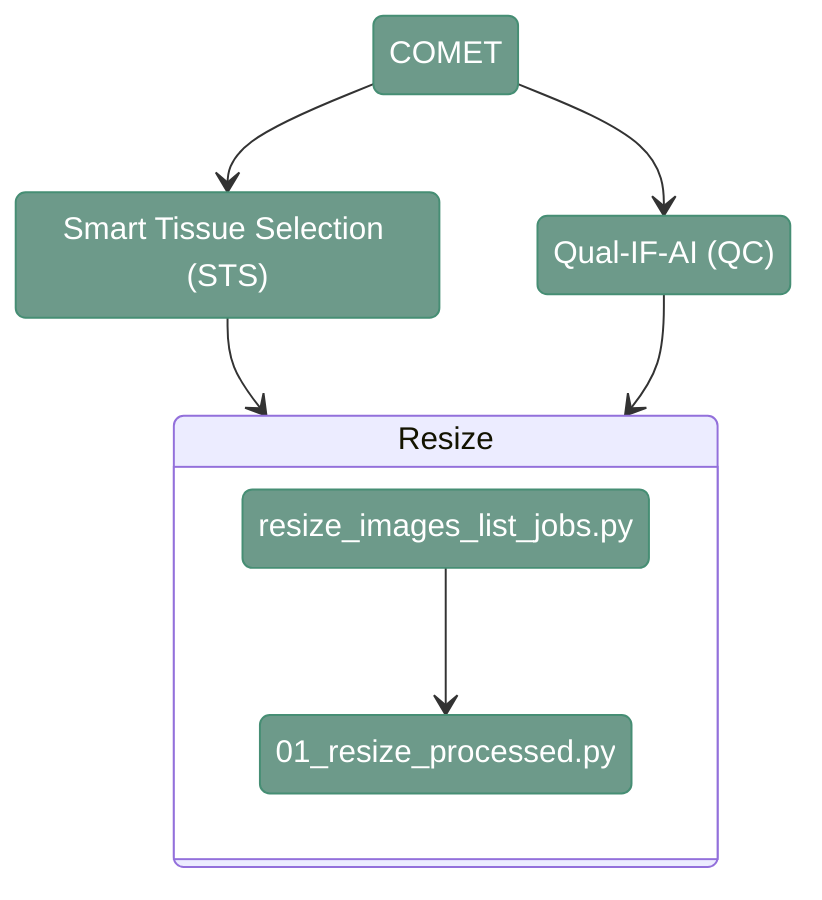

# Resize - COMET 

---

# 1. Overview

---

<div align="center">



</div>

---

# 2. Resize scripts

----

**Script:** [resize_images_list_jobs.py](src/03_hard_stitching/resize_images_list_jobs.py) 

This function lists all the folders in the input directory and generates a csv with the list of jobs that have to be run for coarse stitching. 
Images from COMET needs it to be executed twice, once for STS and once for QUALIFAI.

``` shell
python src/03_hard_stitching/hard_stitching_list_jobs.py \
    --input_path_images <path_to_images/> \
    --output_folder <path_to_output/> \
    --output_path_csv <path_to_joblist.csv> \
    --output_pixel_size <output_pixel_size/> \
    --input_pixel_size <input_pixel_size/>
```


`--input_path_images`
: Path to the directory containing the input images (dir). Example: `path/to/project_directory/output_tiles_tiffs` 

`--output_folder`
: Path to output path to save images (dir). Example:  `path/to/project_directory/resized_images` (STS) or `path/to/project_directory/resized_images_QC` (for QUALIFAI)

`--output_path_csv`
: Path to the CSV file where the generated hard-stitching job list will be stored (.csv). Example: `/path/to/project_directory/resize_STS_job_list.csv`

`--output_pixel_size`
: Pixel size input images (numeric). Example: `2.6` (for STS) or `0.65` (for QUALIFAI).

`--input_pixel_size`
: Pixel size input images (numeric). Example: `0.28` (COMET)


---

**Script:** [01_resize_processed.py](src/03_hard_stitching/01_resize_processed.py) 

This function generates a rescaled, re-nomalized, 8-bit image.

``` shell
python src/03_hard_stitching/01_resize_processed.py \
    --input_path_image <input_path_image/> \
    --output_path_image <output_path_image/> \
    --conversion_factor <conversion_factor/> \
    --skip_existing <skip_existing/> 
```

`--input_path_image`
: Path to the image (.tiff). Example:  `path/to/project_directory/output_tiles_tiff/bmark01_R01_V01_COMET/bmark01_R01_V01_COMET_Cy5.tiff`

`--output_path_image`
: Path to the output image (.tiff). Example:  `path/to/project_directory/resize_STS/test/bmark01_R01_V01_COMET_Cy5.tiff`

`--conversion_factor`
: Conversion factor for downscaling. For example, `0.65/0.28` (QUALIFAI) or `2.6/0.28` (STS)

`--skip_existing`
: Boolean to define whether to skip already existing results. For example, `TRUE`

---