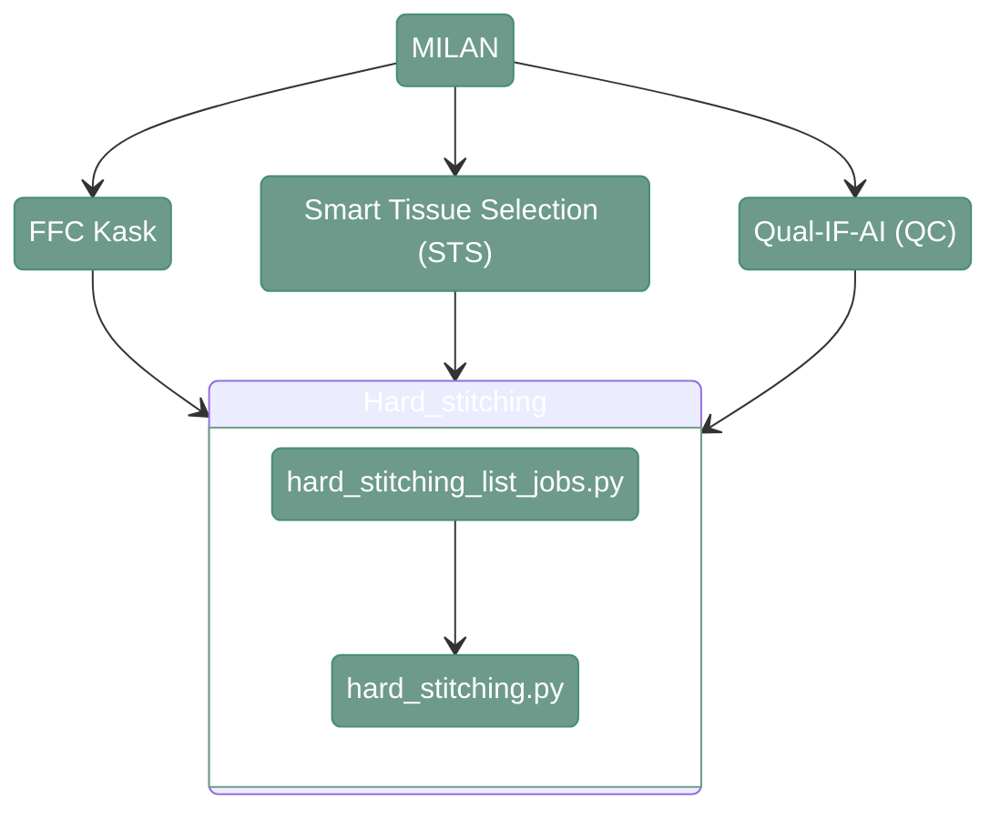

# Hard Stitching - MILAN

---

<div align="center">



</div>

---

## 1. Overview

In MILAN, the hard stitching scripts are used in three different steps: FFC Kask, STS and artifact detection with Qual-IF-AI. 
The input files remain the same in all three steps. The most important difference is the required pixel size - for Kask and STS the output images are downscaled by the factor of 4, in Qual-IF-AI the output needs to be in full resolution. 

---

## 2. Hard stitching scripts

#### **Script 1:** [hard_stitching_list_jobs.py](https://github.com/antoranzlab/DISSCOvery/blob/main/src/03_hard_stitching/hard_stitching_list_jobs.py) 

This script generates coarse stitched images from the individual tiles. 

``` shell
python src/03_hard_stitching/hard_stitching_list_jobs.py \
    --input_path_tiles <path_to_tiles/> \
    --input_path_meta <path_to_metadata/> \
    --output_folder <path_to_output/> \
    --output_path_csv <path_to_joblist.csv> \
    --output_pixel_size <pixel_size/> \
    --only_dapi <only_dapi/> \
    --skip_existing <skip_existing_results/>
```

`--input_path_tiles`
: Path to the directory containing the input tiles (dir). Example: `/path/to/project_directory/output_tiles_tiffs`

`--input_path_meta`
: Path to the directory containing the metadata associated with the input tiles (dir). Example: `/path/to/project_directory/output_tiles_tiffs`

`--output_folder`
: Path to the output directory where the hard-stitching results will be stored (dir). Example: `/path/to/project_directory/hard_stitching_FFC`, `/path/to/project_directory/hard_stitching_STS` or `/path/to/project_directory/hard_stitching_QC`

`--output_path_csv`
: Path to the CSV file where the generated hard-stitching job list will be stored (.csv). Example: `/path/to/project_directory/hard_stitching_FFC_job_list.csv`

`--output_pixel_size`
: Pixel size to use for the hard stitching, 2.6 for FFC Kask or STS, 0.65 for Qual-IF-AI (numeric). Example: `2.6`

`--only_dapi`
: Whether to generate hard-stitching jobs only for the DAPI channel (bool). Example: `True`

`--skip_existing`
: Whether to skip already existing results (bool). Example: `False`                                                                                                                                                              |

!!! warning
    Make sure you are providing the proper pixel size, the models used later for Kask and STS are trained on a different resolution then the Qual-IF-AI model. 
    Using incorrect pixel size may impact the results

----

#### **Script 2:** [hard_stitching.py](https://github.com/antoranzlab/DISSCOvery/blob/main/src/03_hard_stitching/hard_stitching.py) 

This function generates a hard stitched image.

``` shell
python src/03_hard_stitching/hard_stitching.py \
    --input_tiles <path_to_tiles/> \
    --input_meta <path_to_metadata/> \
    --output_folder <path_to_output/> \
    --conversion_factor <conversion_factor/> \
    --only_dapi <only_dapi/> \
    --skip_existing <skip_existing_results/>
```

`--input_tiles`
: Path to the directory containing the input tiles (dir). Example: `/path/to/project_directory/output_tiles_tiffs/BM_R00_V01_BENCHMARK_ND`

`--input_meta`
: Path to the CSV file containing the tile metadata (.csv). Example: `/path/to/project_directory/output_tiles_tiffs/BM_R00_V01_BENCHMARK_ND/full_BM_R00_V01_BENCHMARK_ND_meta.csv`

`--output_folder`
: Path to the folder where the hard stitched images will be stored (dir). Example: `/path/to/project_directory/hard_stitching_FFC/BM`, `/path/to/project_directory/hard_stitching_STS/BM` or `/path/to/project_directory/hard_stitching_QC/BM`

`--conversion_factor`
: Conversion factor for downscaling (numeric), 4 for STS or Kask, 1 for QUALIFAI. Example: `4`

`--only_dapi`
: Whether to process only the DAPI channel (bool). Example: `True`

`--skip_existing`
: Whether to skip already existing results (bool). Example: `False`


!!! note
    The conversion factor is automatically calculated when running job list script and is stored in the generated csv file
---