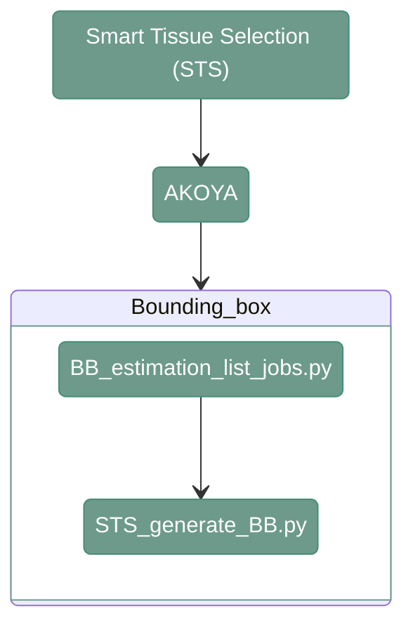

# STS - AKOYA

---

<div align="center">




</div>

---

# 1. Overview

Smart Tissue Selection for AKOYA doesn't require additional image preparation before generating the bounding boxes.

---

# 2. Bounding Box Generation

---

**Script 1:** [04_STS/BB_estimation_list_jobs.py](src/04_STS/BB_estimation_list_jobs.py) 

This function lists all the paths for input and output files and generates a csv with the list of jobs that have to be run for Bounding Boxes Estimation.

```
python src/04_STS/BB_estimation_list_jobs.py \
    --input_path_images <path_to_input_images/> \
    --output_path_bbs <path_to_output_bbs/> \
    --filter_small True \
    --output_path_csv <path_to_joblist.csv/>
```

`--input_path_images`
: Path to the input directory containing the STS masks. Example: `/path/to/project_directory/output_FFC_kask_masks`

`--output_path_bbs`
: Path to the output directory where the estimated bounding boxes will be stored. Example: `/path/to/project_directory/output_STS/BBs`

`--filter_small`
: Whether to filter out small objects when estimating bounding boxes. Example: `True`

`--output_path_csv`
: Path where the generated job list CSV file will be stored (file). Example: `/path/to/project_directory/bb_estimation_joblist.csv`


---

**Script 2:** [04_STS/STS_generate_BB.py](src/04_STS/STS_generate_BB.py) 

The script creates csv files that contains bounding boxes coordinates for each scene

```
python src/04_STS/STS_generate_BB.py \
    --input_image_path <path_to_input_image/> \
    --bbox_tile_path <path_to_output_bounding_boxes/> \
    --filter_small <filter_small/>
```

`--input_image_path`
: Path to the input STS mask image for which bounding boxes will be generated (file). Example: `/path/to/project_directory/output_FFC_kask_masks/test/test_R03_V01_BENCHMARK_ND_DAPI.tiff`

`--bbox_tile_path`
: Path where the generated bounding-box information will be stored (file). Example: `/path/to/project_directory/output_STS/BBs/test/test_R03_V01_BENCHMARK_ND_DAPI.csv`

`--filter_small`
: Whether to filter out small objects when generating bounding boxes. Example: `True`

---
