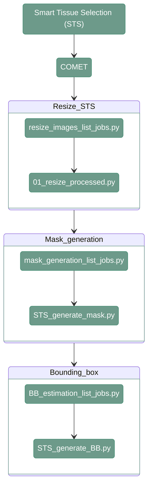

# STS - COMET

---

<div align="center">




</div>

---

## 1. Overview

Smart Tissue Selection for COMET requires to first preparate the input images then generate the tissue masks and bounding boxes.

---

## 2. Resize images STS

#### **Script 1:** [resize_images_list_jobs.py](https://github.com/antoranzlab/DISSCOvery/blob/main/src/03_hard_stitching/resize_images_list_jobs.py) 

This function lists all the folders in the input directory and generates a csv with the list of jobs that have to be run for coarse stitching. 
Images from COMET needs it to be executed twice, once for STS and once for QUALIFAI.

``` shell
python src/03_hard_stitching/resize_images_list_jobs.py \
    --input_path_images <path_to_images/> \
    --output_folder <path_to_output/> \
    --output_path_csv <path_to_joblist.csv> \
    --output_pixel_size <output_pixel_size/> \
    --input_pixel_size <input_pixel_size/>
```


`--input_path_images`
: Path to the directory containing the input images (dir). Example: `path/to/project_directory/output_tiles_tiffs` 

`--output_folder`
: Path to output path to save images (dir). Example:  `path/to/project_directory/resized_images` (STS) or `path/to/project_directory/resized_images_QC` (for QUALIFAI)

`--output_path_csv`
: Path to the CSV file where the generated hard-stitching job list will be stored (.csv). Example: `/path/to/project_directory/resize_STS_job_list.csv`

`--output_pixel_size`
: Pixel size input images (numeric). Example: `2.6` (for STS) or `0.65` (for QUALIFAI).

`--input_pixel_size`
: Pixel size input images (numeric). Example: `0.28` (COMET)


---

#### **Script 2:** [01_resize_processed.py](https://github.com/antoranzlab/DISSCOvery/blob/main/src/03_hard_stitching/01_resize_processed.py) 

This function generates a rescaled, re-nomalized, 8-bit image.

``` shell
python src/03_hard_stitching/01_resize_processed.py \
    --input_path_image <input_path_image/> \
    --output_path_image <output_path_image/> \
    --conversion_factor <conversion_factor/> \
    --skip_existing <skip_existing/> 
```

`--input_path_image`
: Path to the image (.tiff). Example:  `path/to/project_directory/output_tiles_tiff/bmark01_R01_V01_COMET/bmark01_R01_V01_COMET_Cy5.tiff`

`--output_path_image`
: Path to the output image (.tiff). Example:  `path/to/project_directory/resize_STS/test/bmark01_R01_V01_COMET_Cy5.tiff`

`--conversion_factor`
: Conversion factor for downscaling. For example, `0.65/0.28` (QUALIFAI) or `2.6/0.28` (STS)

`--skip_existing`
: Boolean to define whether to skip already existing results. For example, `TRUE`

---

## 3. Mask generation scripts

#### **Script 1:** [mask_generation_list_jobs.py](https://github.com/antoranzlab/DISSCOvery/blob/main/src/04_STS/mask_generation_list_jobs.py) 

This function lists all the paths for input and output files and generates a csv with the list of jobs that have to be run for Mask Generation.

```
python src/04_STS/mask_generation_list_jobs.py \
    --input_path_images <path_to_input_images/> \
    --output_path_images <path_to_output_images/> \
    --path_model <path_to_model/> \
    --output_path_csv <path_to_joblist.csv> \
    --ref_channel <reference_channel/>
```

`--input_path_images`
: Path to the input directory containing the coarse-registered images. Example: `/path/to/project_directory/output_tiles_tiff/`

`--output_path_images`
: Path to the output directory where the generated STS masks will be stored. Example:` /path/to/project_directory/output_STS/output_masks/`

`--path_model`
: Path to the model used for mask generation (file). Example: `./DISSCOvery/models/04_model.pt`

`--output_path_csv`
: Path where the generated job list CSV file will be stored (file). Example: `/path/to/project_directory/output_STS/sts_mask_joblist.csv`

`--ref_channel`
: Reference channel used for mask generation. Example: `DAPI`

#### **Script 2:** [STS_generate_mask.py](https://github.com/antoranzlab/DISSCOvery/blob/main/src/04_STS/STS_generate_mask.py) 

The script creates tissue masks. 

```
python src/04_STS/STS_generate_mask.py \
    --input_image_path <path_to_input_image/> \
    --output_image_path <path_to_output_image/> \
    --model_path <path_to_model/>
```

`--input_image_path`
: Path to the input image for which the mask will be generated (file). Example: `/path/to/project_directory/output_tiles_tiff/test_R01_V01_DAPI.tiff`

`--output_image_path`
: Path where the generated mask will be stored (file). Example: `/path/to/project_directory/output_STS/output_masks/test_R01_V01_mask.tiff`

`--model_path`
: Path to the model used for mask generation (file). Example: `./DISSCOvery/models/04_model.pt`

---

## 4. Bounding Box Generation

---

#### **Script 1:** [BB_estimation_list_jobs.py](https://github.com/antoranzlab/DISSCOvery/blob/main/src/04_STS/BB_estimation_list_jobs.py) 

This function lists all the paths for input and output files and generates a csv with the list of jobs that have to be run for Bounding Boxes Estimation.

```
python src/04_STS/BB_estimation_list_jobs.py \
    --input_path_images <path_to_input_images/> \
    --output_path_bbs <path_to_output_bbs/> \
    --filter_small True \
    --output_path_csv <path_to_joblist.csv/>
```

`--input_path_images`
: Path to the input directory containing the STS masks. Example: `/path/to/project_directory/output_STS/output_masks/`

`--output_path_bbs`
: Path to the output directory where the estimated bounding boxes will be stored. Example: `/path/to/project_directory/output_STS/BBs`

`--filter_small`
: Whether to filter out small objects when estimating bounding boxes. Example: `True`

`--output_path_csv`
: Path where the generated job list CSV file will be stored (file). Example: `/path/to/project_directory/bb_estimation_joblist.csv`


---

#### **Script 2:** [STS_generate_BB.py](https://github.com/antoranzlab/DISSCOvery/blob/main/src/04_STS/STS_generate_BB.py) 

The script creates csv files that contains bounding boxes coordinates for each scene

```
python src/04_STS/STS_generate_BB.py \
    --input_image_path <path_to_input_image/> \
    --bbox_tile_path <path_to_output_bounding_boxes/> \
    --filter_small <filter_small/>
```

`--input_image_path`
: Path to the input STS mask image for which bounding boxes will be generated (file). Example: `/path/to/project_directory/output_STS/output_masks/test/test_R03_V01_BENCHMARK_ND_DAPI.tiff`

`--bbox_tile_path`
: Path where the generated bounding-box information will be stored (file). Example: `/path/to/project_directory/output_STS/BBs/test/test_R03_V01_BENCHMARK_ND_DAPI.csv`

`--filter_small`
: Whether to filter out small objects when generating bounding boxes. Example: `True`

---
