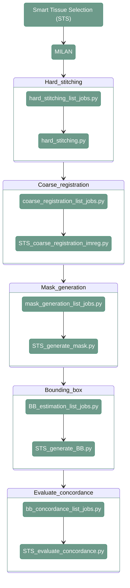

# STS - MILAN

---

<div align="center">




</div>

---

# 1. Overview

Smart Tissue Selection for MILAN is a complex steps and requires to first preparate the input images after FFC to generate the mask and bounding boxes.
Additionally, to the data quality the bounding boxes concordance is check as the last step. 

---

# 2. Hard stitching scripts

#### **Script 1:** [hard_stitching_list_jobs.py](src/03_hard_stitching/hard_stitching_list_jobs.py) 

This script generates coarse stitched images from the individual tiles. 

``` shell
python src/03_hard_stitching/hard_stitching_list_jobs.py \
    --input_path_tiles <path_to_tiles/> \
    --input_path_meta <path_to_metadata/> \
    --output_folder <path_to_output/> \
    --output_path_csv <path_to_joblist.csv> \
    --output_pixel_size <pixel_size/> \
    --only_dapi <only_dapi/> \
    --skip_existing <skip_existing_results/>
```

`--input_path_tiles`
: Path to the directory containing the input tiles (dir). Example: `/path/to/project_directory/output_tiles_tiffs`

`--input_path_meta`
: Path to the directory containing the metadata associated with the input tiles (dir). Example: `/path/to/project_directory/output_tiles_tiffs`

`--output_folder`
: Path to the output directory where the hard-stitching results will be stored (dir). Example: `/path/to/project_directory/hard_stitching_FFC`, `/path/to/project_directory/hard_stitching_STS` or `/path/to/project_directory/hard_stitching_QC`

`--output_path_csv`
: Path to the CSV file where the generated hard-stitching job list will be stored (.csv). Example: `/path/to/project_directory/hard_stitching_FFC_job_list.csv`

`--output_pixel_size`
: Pixel size to use for the hard stitching, 2.6 for FFC Kask or STS, 0.65 for Qual-IF-AI (numeric). Example: `2.6`

`--only_dapi`
: Whether to generate hard-stitching jobs only for the DAPI channel (bool). Example: `True`

`--skip_existing`
: Whether to skip already existing results (bool). Example: `False`                                                                                                                                                              |

!!! warning
    Make sure you are providing the proper pixel size, the models used later for Kask and STS are trained on a different resolution then the Qual-IF-AI model. 
    Using incorrect pixel size may impact the results

----

#### **Script 2:** [hard_stitching.py](src/03_hard_stitching/hard_stitching.py) 

This function generates a hard stitched image.

``` shell
python src/03_hard_stitching/hard_stitching.py \
    --input_tiles <path_to_tiles/> \
    --input_meta <path_to_metadata/> \
    --output_folder <path_to_output/> \
    --conversion_factor <conversion_factor/> \
    --only_dapi <only_dapi/> \
    --skip_existing <skip_existing_results/>
```

`--input_tiles`
: Path to the directory containing the input tiles (dir). Example: `/path/to/project_directory/output_tiles_tiffs/BM_R00_V01_BENCHMARK_ND`

`--input_meta`
: Path to the CSV file containing the tile metadata (.csv). Example: `/path/to/project_directory/output_tiles_tiffs/BM_R00_V01_BENCHMARK_ND/full_BM_R00_V01_BENCHMARK_ND_meta.csv`

`--output_folder`
: Path to the folder where the hard stitched images will be stored (dir). Example: `/path/to/project_directory/hard_stitching_FFC/BM`, `/path/to/project_directory/hard_stitching_STS/BM` or `/path/to/project_directory/hard_stitching_QC/BM`

`--conversion_factor`
: Conversion factor for downscaling (numeric), 4 for STS or Kask, 1 for QUALIFAI. Example: `4`

`--only_dapi`
: Whether to process only the DAPI channel (bool). Example: `True`

`--skip_existing`
: Whether to skip already existing results (bool). Example: `False`


!!! note
    The conversion factor is automatically calculated when running job list script and is stored in the generated csv file
---

# 3. Coarse registration scripts

#### **Script 1:** [coarse_registration_list_jobs.py](src/03_hard_stitching/hard_stitching_list_jobs.py) 

This function lists all the paths for input and output files and generates a csv with the list of jobs that have to be run for Coarse Registration.

```
python src/04_STS/coarse_registration_list_jobs.py \
    --input_path_images <path_to_images/> \
    --output_path_images <path_to_output_images/> \
    --output_path_tm <path_to_transformations/> \
    --ref_channel <reference_channel/> \
    --ref_round <reference_round/> \
    --ref_version <reference_version/> \
    --output_path_csv <path_to_joblist.csv/>
```

`--input_path_images`
: Path to the directory containing the input hard-stitched images (dir). Example: `/path/to/project_directory/hard_stitching_STS`

`--output_path_images`
: Path to the output directory where the coarsely registered images will be stored (dir). Example: `/path/to/project_directory/output_STS/output_coarse_registration/images
`
`--output_path_tm`
: Path to the output directory where the coarse registration transformation matrices will be stored (dir). Example: `/path/to/project_directory/output_STS/output_coarse_registration/tm`

`--ref_channel`
: Identifier of the reference channel used for coarse registration (str). Example: `DAPI`

`--ref_round`
: Identifier of the reference acquisition round used for coarse registration (str). Example: `R01`

`--ref_version`
: Version identifier of the reference image used for coarse registration (str). Example: `V01`

`--output_path_csv`
: Path to the CSV file where the generated coarse-registration job list will be stored (.csv). Example: `/path/to/project_directory/coarse_registration_job_list.csv`

#### **Script 2:** [STS_coarse_registration_imreg.py](src/03_hard_stitching/hard_stitching_list_jobs.py) 

The script performs coarse registration with Imreg.

```
python src/04_STS/STS_coarse_registration_imreg.py \
    --path_fixed_image <path_to_fixed_image/> \
    --path_query_image <path_to_query_image/> \
    --path_query_registered <path_to_registered_image/> \
    --path_transformation_matrix <path_to_transformation_matrix/> \
    --qc_log_path <path_to_qc_log/> \
    --zscore_threshold <zscore_threshold/>
```

`--path_fixed_image`
: Path to the fixed/reference image used for registration (file). Example: `/path/to/project_directory/hard_stitching_STS/test/test_R01_V01_DAPI.tiff`

`--path_query_image`
: Path to the query image that will be registered to the fixed image (file). Example: `/path/to/project_directory/hard_stitching_STS/test/test_R02_V01_DAPI.tiff`

`--path_query_registered`
: Path where the registered query image will be stored (file). Example: `/path/to/project_directory/output_STS/output_coarse_registration/images/test_R02_V01_DAPI.tiff`

`--path_transformation_matrix`
: Path where the transformation matrix generated during registration will be stored (file). Example: `/path/to/project_directory/output_STS/output_coarse_registration/tm/test_R02_V01_DAPI.tiff.npy`

`--qc_log_path`
: Path to the file where quality-control information from the registration will be stored (file). Example: `/path/to/project_directory/output_STS/output_coarse_registration/qc/query_qc.csv`

`--zscore_threshold`
: Z-score threshold used for quality control of the registration (numeric). Example: `20`


# 4. Mask generation scripts

#### **Script 1:** [mask_generation_list_jobs.py](src/03_hard_stitching/hard_stitching_list_jobs.py) 

This function lists all the paths for input and output files and generates a csv with the list of jobs that have to be run for Mask Generation.

```
python src/04_STS/mask_generation_list_jobs.py \
    --input_path_images <path_to_input_images/> \
    --output_path_images <path_to_output_images/> \
    --path_model <path_to_model/> \
    --output_path_csv <path_to_joblist.csv> \
    --ref_channel <reference_channel/>
```

`--input_path_images`
: Path to the input directory containing the coarse-registered images. Example: `/path/to/project_directory/output_STS/output_coarse_registration/images/`

`--output_path_images`
: Path to the output directory where the generated STS masks will be stored. Example:` /path/to/project_directory/output_STS/output_masks/`

`--path_model`
: Path to the model used for mask generation (file). Example: `./DISSCOvery/models/04_model.pt`

`--output_path_csv`
: Path where the generated job list CSV file will be stored (file). Example: `/path/to/project_directory/output_STS/sts_mask_joblist.csv`

`--ref_channel`
: Reference channel used for mask generation. Example: `DAPI`

#### **Script 2:** [STS_generate_mask.py](src/03_hard_stitching/hard_stitching_list_jobs.py) 

The script creates tissue masks. 

```
python src/04_STS/STS_generate_mask.py \
    --input_image_path <path_to_input_image/> \
    --output_image_path <path_to_output_image/> \
    --model_path <path_to_model/>
```

`--input_image_path`
: Path to the input image for which the mask will be generated (file). Example: `/path/to/project_directory/output_STS/output_coarse_registration/images/test_R01_V01_DAPI.tiff`

`--output_image_path`
: Path where the generated mask will be stored (file). Example: `/path/to/project_directory/output_STS/output_masks/test_R01_V01_mask.tiff`

`--model_path`
: Path to the model used for mask generation (file). Example: `./DISSCOvery/models/04_model.pt`

---

# 5. Bounding Box Generation

---

**Script 1:** [04_STS/BB_estimation_list_jobs.py](src/04_STS/BB_estimation_list_jobs.py) 

This function lists all the paths for input and output files and generates a csv with the list of jobs that have to be run for Bounding Boxes Estimation.

```
python src/04_STS/BB_estimation_list_jobs.py \
    --input_path_images <path_to_input_images/> \
    --output_path_bbs <path_to_output_bbs/> \
    --filter_small True \
    --output_path_csv <path_to_joblist.csv/>
```

`--input_path_images`
: Path to the input directory containing the STS masks. Example: `/path/to/project_directory/output_STS/output_masks/`

`--output_path_bbs`
: Path to the output directory where the estimated bounding boxes will be stored. Example: `/path/to/project_directory/output_STS/BBs`

`--filter_small`
: Whether to filter out small objects when estimating bounding boxes. Example: `True`

`--output_path_csv`
: Path where the generated job list CSV file will be stored (file). Example: `/path/to/project_directory/bb_estimation_joblist.csv`


---

**Script 2:** [04_STS/STS_generate_BB.py](src/04_STS/STS_generate_BB.py) 

The script creates csv files that contains bounding boxes coordinates for each scene

```
python src/04_STS/STS_generate_BB.py \
    --input_image_path <path_to_input_image/> \
    --bbox_tile_path <path_to_output_bounding_boxes/> \
    --filter_small <filter_small/>
```

`--input_image_path`
: Path to the input STS mask image for which bounding boxes will be generated (file). Example: `/path/to/project_directory/output_STS/output_masks/test/test_R03_V01_BENCHMARK_ND_DAPI.tiff`

`--bbox_tile_path`
: Path where the generated bounding-box information will be stored (file). Example: `/path/to/project_directory/output_STS/BBs/test/test_R03_V01_BENCHMARK_ND_DAPI.csv`

`--filter_small`
: Whether to filter out small objects when generating bounding boxes. Example: `True`

---

# 6. Evaluate concordance 

---

**Script 1:** [04_STS/bb_concordance_list_jobs.py](src/04_STS/bb_concordance_list_jobs.py) 

This function lists all the paths for input and output files and generates a csv with the list of jobs that have to be run for concordance evaluation 


```
python src/04_STS/bb_concordance_list_jobs.py \
    --input_path_BB <path_to_input_bounding_boxes/> \
    --output_path_html <path_to_output_html/> \
    --output_path_json <path_to_output_json/> \
    --path_output_csv <path_to_joblist.csv/> \
    --ref_round <reference_round/> \
    --ref_version <reference_version/>
```

`--input_path_BB`
: Path to the directory containing the input bounding-box files. Example: `/path/to/project_directory/output_STS/BBs`

`--output_path_html`
: Path to the output directory where HTML quality-control reports will be stored. Example: `/path/to/project_directory/output_STS/heatmaps_html/`

`--output_path_json`
: Path to the output directory where JSON files containing bounding-box concordance results will be stored. Example: `/path/to/project_directory/output_STS/heatmaps_json/`

`--path_output_csv`
: Path where the generated job list CSV file will be stored (file). Example: `/path/to/project_directory/output_STS/bb_concordance_job_list.csv`

`--ref_round`
: Reference round used for bounding-box concordance. Example: `R01`

`--ref_version`
: Reference version used for bounding-box concordance. Example: `V01`

---

**Script 2:** [04_STS/STS_evaluate_concordance.py](src/04_STS/STS_evaluate_concordance.py)

This script performs concordance evaluation. 

```
python src/04_STS/STS_evaluate_concordance.py \
    --input_path_BB <path_to_input_bounding_boxes/> \
    --output_heatmap_path_html <path_to_output_html/> \
    --output_heatmap_path_json <path_to_output_json/> \
    --reference_round <reference_round/> \
    --reference_version <reference_version/>
```

`--input_path_BB`
: Path to the directory containing the input bounding-box files. Example: `/path/to/project_directory/output_STS/BBs/test`

`--output_heatmap_path_html`
: Path where the HTML concordance heatmap will be stored. Example: `/path/to/project_directory/output_STS/heatmaps_html/test/interactive_heatmap.html`

`--output_heatmap_path_json`
: Path where the JSON concordance results will be stored. Example: `/path/to/project_directory/output_STS/heatmaps_html/test/interactive_heatmap.json`

`--reference_round`
: Reference round used for the concordance evaluation. Example: `R01`

`--reference_version`
: Reference version used for the concordance evaluation. Example: `V01`