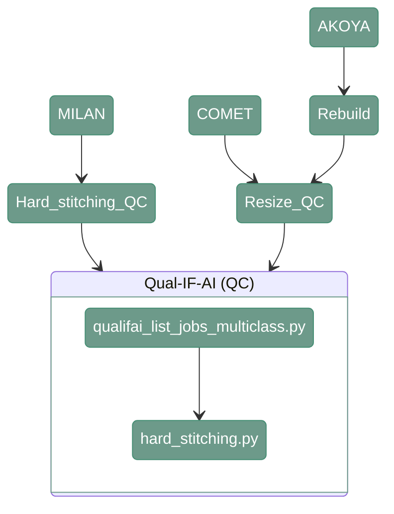

# QUALIFAI

---

<div align="center">



</div>

---

## 1. Overview

This function takes as an input the directory of a hard stitched, full resolution images, or equivalent, and lists all the jobs to be run with [QUALIFAI](https://github.com/antoranzlab/QualIFAI)

---

## 2. QUALIFAI

#### **Script 1:** [qualifai_list_jobs_multiclass.py](https://github.com/antoranzlab/DISSCOvery/blob/main/src/05_artifacts_detection/qualifai_list_jobs_multiclass.py) 


```
python src/05_artifacts_detection/qualifai_list_jobs_multiclass.py \
    --input_folder_path <path_to_input_folder/> \
    --output_folder_path <path_to_output_folder/> \
    --model_path <path_to_model/> \
    --output_path_csv <path_to_joblist.csv/>
```

`--input_folder_path`
: Path to the input directory containing the QC images from the resizing step. Example: `/path/to/project_directory/resized_images_qc/` (AKOYA, COMET) or `/path/to/project_directory/hard_stitching_QC/` (MILAN)

`--output_folder_path`
: Path to the output directory where QUALIFAI results will be stored. Example: `/path/to/project_directory/output_QUALIFAI/`

`--model_path`
: Path to the QUALIFAI model used for artifact detection (file). Example: `/path/to/project_directory/models/05_unetpp_best.pth`

`--output_path_csv`
: Path where the generated job list CSV file will be stored (file). Example: `/path/to/project_directory/qualifai_list_jobs.csv`

---

#### **Script 2:** [QUALIFAI.py](https://github.com/antoranzlab/DISSCOvery/blob/main/src/05_artifacts_detection/QUALIFAI.py) 

```
python src/05_artifacts_detection/QUALIFAI.py \
    --input_image_path <path_to_input_image/> \
    --output_image_path <path_to_output_image/> \
    --model_path <path_to_model/>
```

`--input_image_path`
: Path to the input image to be processed by QUALIFAI (file). Example: `/path/to/project_directory/resized_images_qc/test/test_R01_V01.tiff` (AKOYA, COMET) or `/path/to/project_directory/hard_stitching_QC/test/test_R01_V01.tiff` (MILAN)

`--output_image_path`
: Path where the QUALIFAI output image will be stored (file). Example: `/path/to/project_directory/output_QUALIFAI/test/test_R01_V01.tiff`

`--model_path`
: Path to the QUALIFAI model used for artifact detection (file). Example: `/path/to/project_directory/models/05_unetpp_best.pth`

---