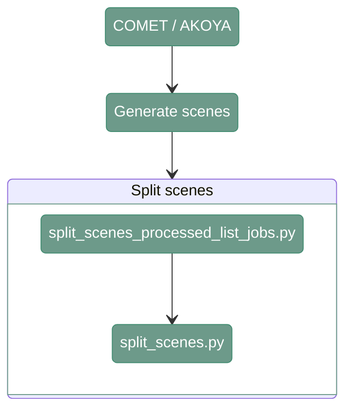

# Split scenes COMET / AKOYA

---

<div align="center">



</div>

---

# 1. Overview

Split scenes cut the input image into smaller scenes

---

# 2. Generate scenes

**Script 1:** [generate_scenes_csv.py](src/06_split_scenes/generate_scenes_csv.py) 

The script generates CSV file that is necessary to run cell phenotyping and assigning cells to specific tissues

```
python src/06_split_scenes/generate_scenes_csv.py \
    --input_path_bb <path_to_input_bounding_boxes/> \
    --reference_map_json <path_to_reference_map_json/> \
    --output_path_csv <path_to_experimental_design_scenes.csv/>
```

`--input_path_bb`
: Path to the directory containing the input bounding-box files generated during the STS processing. Example: `/path/to/project_directory/output_STS/BBs/`

`--reference_map_json`
: Path to the JSON file containing the reference mapping between slides, rounds, and versions. Example: `/path/to/project_directory/reference_map_slide_round_version.json`

The .json input should be provided in the following format:
```
{
  "test": {
    "reference_round": "R01",
    "reference_version": "V01"
  }
}
```

`--output_path_csv`
: Path where the experimental design CSV file containing the scene information will be stored (file). Example: `/path/to/project_directory/experimental_design/experimental_design_scenes.csv`

---

# 3. Split scenes

The script generates CSV job list file


**Script 1:** [split_scenes_processed_list_jobs.py](src/06_split_scenes/split_scenes_processed_list_jobs.py) 

```
python src/06_split_scenes/split_scenes_processed_list_jobs.py \
    --input_path_images <path_to_input_images/> \
    --input_bb <path_to_input_bounding_boxes/> \
    --input_mask_foreground <path_to_foreground_masks/> \
    --input_mask_qc <path_to_qc_masks/> \
    --pixel_size_full <full_resolution_pixel_size/> \
    --reference_map_json <path_to_reference_map_json/> \
    --pixel_size_sts <sts_pixel_size/> \
    --pixel_size_qc <qc_pixel_size/> \
    --output_folder <path_to_output_folder/> \
    --output_path_csv <path_to_joblist.csv/> \
    --ref_channel <reference_channel/>
```

--input_path_images
: Path to directory containing input raw tiles. Example: `/path/to/project_directory/output_tiles_tiff/` (COMET) or `/path/to/project_directory/output_processed/` (AKOYA)

--input_bb
: Path to directory containing input bounding-box files. Example: `/path/to/project_directory/output_STS/BBs/`

--input_mask_foreground
: Path to directory containing foreground masks. Example: `/path/to/project_directory/output_STS/output_masks/`

--input_mask_qc
: Path to directory containing QUALIFAI QC masks/results. Example: `/path/to/project_directory/output_QUALIFAI/`

--pixel_size_full
: Pixel size of the full-resolution input images. Example: `0.28` (COMET), `0.5` (AKOYA)

--reference_map_json
: Path to the JSON file containing the reference mapping between slides, rounds, and versions. Example: `/path/to/project_directory/reference_map_slide_round_version.json`

--pixel_size_sts
: Output pixel size for STS images. Example: `2.6`

--pixel_size_qc
: Output pixel size for QC images. Example: `0.65`

`--output_folder`
: Path to the output directory for split scenes. Example: `/path/to/project_directory/split_scenes/`

`--output_path_csv`
: Path to the output CSV job list. Example: `/path/to/project_directory/split_scenes_job_list.csv`

`--ref_channel`
: Reference image channel used for scene generation. Example: `DAPI`

---

**Script 2:** [split_scenes_processed.py](src/06_split_scenes/split_scenes_processed.py) 

Splits the slides into scenes


```
python src/06_split_scenes/split_scenes_processed.py \
    --input_path_image <path_to_input_image/> \
    --input_path_bb <path_to_input_bounding_boxes/> \
    --input_path_foreground <path_to_foreground_masks/> \
    --input_path_qc <path_to_qc_masks/> \
    --output_path_image <path_to_output_image/> \
    --conversion_factor_sts <conversion_factor_sts/> \
    --conversion_factor_qc <conversion_factor_qc/> \
    --skip_existing <skip_existing/>
```

`--input_path_image`
: Path to the input image. Example: `/path/to/project_directory/output_tiles_tiff/test_R01_V01_BM_KN/test_R01_V01_BM_KN_Cy5.tiff` (COMET) or `/path/to/project_directory/output_processed/test_R01_V01_BM_KN/test_R01_V01_BM_KN_Cy5.tiff` (AKOYA)

`--input_path_bb`
: Path to the input bounding-box file or directory. Example: `/path/to/project_directory/output_STS/BBs_reverse/test/test_R01_V01_BENCHMARK_ND_DAPI.tiff`

`--input_path_foreground`
: Path to the foreground mask. Example: `/path/to/project_directory/output_STS/output_masks_reverse/test/test_R01_V01_BENCHMARK_ND_DAPI.tiff`

`--input_path_qc`
: Path to the QC mask or result. Example: `/path/to/project_directory/output_QUALIFAI/test/test_R01_V01_BENCHMARK_ND_DAPI.tiff`

`--output_path_image`
: Path to the output directory for the split scenes. Example: `/path/to/project_directory/split_scenes`

`--conversion_factor_sts`
: Conversion factor used for STS images. Example: `2.6/0.28` (COMET) `2.6/0.5` (AKOYA)

`--conversion_factor_qc`
: Conversion factor used for QC images. Example: `0.65/0.28` (COMET) `0.65/0.5` (AKOYA)

`--skip_existing`
: Whether to skip scenes that already exist. Example: `False`


---