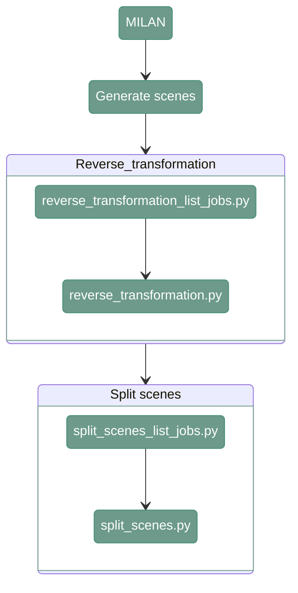

# Split scenes MILAN

---

<div align="center">



</div>

---

## 1. Overview

Split scenes cut the input image into smaller scenes

---

## 2. Generate scenes

#### **Script 1:** [generate_scenes_csv.py](https://github.com/antoranzlab/DISSCOvery/blob/main/src/06_split_scenes/generate_scenes_csv.py) 

The script generates CSV file that is necessary to run cell phenotyping and assigning cells to specific tissues

```
python src/06_split_scenes/generate_scenes_csv.py \
    --input_path_bb <path_to_input_bounding_boxes/> \
    --reference_map_json <path_to_reference_map_json/> \
    --output_path_csv <path_to_experimental_design_scenes.csv/>
```

`--input_path_bb`
: Path to the directory containing the input bounding-box files generated during the STS processing. Example: `/path/to/project_directory/output_STS/BBs/`

`--reference_map_json`
: Path to the JSON file containing the reference mapping between slides, rounds, and versions. Example: `/path/to/project_directory/reference_map_slide_round_version.json`

The .json input should be provided in the following format:
```
{
  "test": {
    "reference_round": "R01",
    "reference_version": "V01"
  }
}
```

`--output_path_csv`
: Path where the experimental design CSV file containing the scene information will be stored (file). Example: `/path/to/project_directory/experimental_design/experimental_design_scenes.csv`

---

## 3. Reverse_transformation

This function lists all the paths for input and output files and generates a csv with the list of jobs that have to be run for reverse transformation


#### **Script 1:** [reverse_transformation_list_jobs.py](https://github.com/antoranzlab/DISSCOvery/blob/main/src/06_split_scenes/reverse_transformation_list_jobs.py) 

```
python src/06_split_scenes/reverse_transformation_list_jobs.py \
    --input_path_bb <path_to_input_bounding_boxes/> \
    --reference_map_json <path_to_reference_map_json/> \
    --input_path_tm <path_to_transformation_matrices/> \
    --input_path_masks <path_to_input_masks/> \
    --output_path_masks <path_to_output_masks/> \
    --output_path_bb <path_to_output_bounding_boxes/> \
    --output_path_csv <path_to_joblist.csv/> \
    --input_path_hard_stitching <path_to_hard_stitching/>
```

`--input_path_bb`
: Path to the directory containing the input bounding-box files. Example: `/path/to/project_directory/output_STS/BBs/`

`--reference_map_json`
: Path to the JSON file containing the reference mapping between slides, rounds, and versions. Example: `/path/to/project_directory/reference_map_slide_round_version.json`

`--input_path_tm`
: Path to the directory containing the coarse-registration transformation matrices. Example: `/path/to/project_directory/output_STS/output_coarse_registration/tm/`

`--input_path_masks`
: Path to the directory containing the input STS masks. Example: `/path/to/project_directory/output_STS/output_masks/`

`--output_path_masks`
: Path to the output directory where the reverse-transformed masks will be stored. Example: `/path/to/project_directory/output_STS/output_masks_reverse/`

`--output_path_bb`
: Path to the output directory where the reverse-transformed bounding boxes will be stored. Example: `/path/to/project_directory/output_STS/BBs_reverse/`

`--output_path_csv`
: Path where the generated reverse-transformation job list CSV file will be stored (file). Example: `/path/to/project_directory/reverse_transformation_job_list.csv`

`--input_path_hard_stitching`
: Path to the hard-stitching output directory used as input for the reverse transformation. Example: `/path/to/project_directory/hard_stitching_STS`

---

#### **Script 2:** [reverse_transformation.py](https://github.com/antoranzlab/DISSCOvery/blob/main/src/06_split_scenes/reverse_transformation.py) 

The script projects the masks and bounding boxes from the reference round to other rounds - it inverts the transformation matrix obtained during the coarse registration

```
python src/06_split_scenes/reverse_transformation.py \
    --input_path_tm <path_to_transformation_matrix/> \
    --input_path_masks <path_to_input_masks/> \
    --input_path_bb <path_to_input_bounding_boxes/> \
    --query_native_shape_path <path_to_query_native_shape/> \
    --output_path_masks <path_to_output_masks/> \
    --output_path_bb <path_to_output_bounding_boxes/>
```

`--input_path_tm`
: Path to the transformation matrix used for the reverse transformation (file). Example: `/path/to/project_directory/output_STS/output_coarse_registration/tm/test/test_R02_V01.tiff.npy`

`--input_path_masks`
: Path to the input masks that will be reverse-transformed. Example: `/path/to/project_directory/output_STS/output_masks/test/test_R02_V01_BENCHMARK_ND_DAPI.tiff`

`--input_path_bb`
: Path to the input bounding-box file or directory containing the bounding boxes to be reverse-transformed. Example: `/path/to/project_directory/output_STS/BBs/test/test_R01_V01_BENCHMARK_ND_DAPI.csv`

`--query_native_shape_path`
: Path to the file containing the native shape of the query image, used to determine the output dimensions after reverse transformation. Example: `/path/to/project_directory/hard_stitching_STS/test/test_R02_V01_BENCHMARK_ND_DAPI.tiff`

`--output_path_masks`
: Path where the reverse-transformed masks will be stored. Example: `/path/to/project_directory/output_STS/output_masks_reverse/test/test_R02_V01_BENCHMARK_ND_DAPI.tiff`

`--output_path_bb`
: Path where the reverse-transformed bounding boxes will be stored. Example: `/path/to/project_directory/output_STS/BBs_reverse/test/test_R02_V01_BENCHMARK_ND_DAPI.csv`

---

## 4. Split scenes

#### **Script 1:** [split_scenes_list_jobs.py](https://github.com/antoranzlab/DISSCOvery/blob/main/src/06_split_scenes/split_scenes_list_jobs.py) 

This function lists all the paths for input and output files and generates a csv with the list of jobs that have to be run for split scenes

```
python src/06_split_scenes/split_scenes_list_jobs.py \
    --input_path_tiles <path_to_input_tiles/> \
    --input_path_meta <path_to_input_metadata/> \
    --input_path_bb <path_to_input_bounding_boxes/> \
    --input_path_masks_foreground <path_to_foreground_masks/> \
    --input_path_masks_qc <path_to_qc_masks/> \
    --output_path_error_log <path_to_error_log/> \
    --px_size_sts <sts_pixel_size/> \
    --px_size_qc <qc_pixel_size/> \
    --output_path_folder <path_to_output_folder/> \
    --output_path_csv <path_to_joblist.csv/> \
    --skip_existing <skip_existing/>
```

`--input_path_tiles`
: Path to the directory containing the FFC-corrected input tiles. Example: `/path/to/project_directory/output_FFC_corrected/`

`--input_path_meta`
: Path to the directory containing the metadata associated with the FFC-corrected tiles. Example: `/path/to/project_directory/output_FFC_corrected/`

`--input_path_bb`
: Path to the directory containing the reverse-transformed bounding boxes. Example: `/path/to/project_directory/output_STS/BBs_reverse/`

`--input_path_masks_foreground`
: Path to the directory containing the reverse-transformed foreground masks. Example: `/path/to/project_directory/output_STS/output_masks_reverse/`

`--input_path_masks_qc`
: Path to the directory containing the QUALIFAI QC masks/results. Example: `/path/to/project_directory/output_QUALIFAI/`

`--output_path_error_log`
: Path to the directory where errors encountered during scene splitting will be logged. Example: `/path/to/project_directory/split_scenes_errors_logs/`

`--px_size_sts`
: Pixel size of the STS images used for scene splitting. Example: `2.6`

`--px_size_qc`
: Pixel size of the QC images used for scene splitting. Example: `0.65`

`--output_path_folder`
: Path to the output directory where the split scenes will be stored. Example: `/path/to/project_directory/split_scenes/`

`--output_path_csv`
: Path where the generated split-scenes job list CSV file will be stored (file). Example: `/path/to/project_directory/split_scenes_job_list.csv`

`--skip_existing`
: Whether to skip scenes for which output files already exist. Example: `True`

---

#### **Script 2:** [split_scenes.py](https://github.com/antoranzlab/DISSCOvery/blob/main/src/06_split_scenes/split_scenes.py) 

This function generates separate scenes from the original images

```
python src/06_split_scenes/split_scenes.py \
    --input_path_tiles <path_to_input_tiles/> \
    --input_path_meta <path_to_input_metadata/> \
    --input_path_bb <path_to_input_bounding_boxes/> \
    --input_path_masks_foreground <path_to_foreground_masks/> \
    --input_path_masks_qc <path_to_qc_masks/> \
    --output_path_folder <path_to_output_folder/> \
    --conversion_factor_sts <conversion_factor_sts/> \
    --conversion_factor_qc <conversion_factor_qc/> \
    --channel_id <channel_id/> \
    --skip_existing <skip_existing/>
```

`--input_path_tiles`
: Path to the directory containing the input FFC-corrected tiles. Example: `/path/to/project_directory/output_FFC_corrected/test_R01_V01_BENCHMARK_ND`

`--input_path_meta`
: Path to the directory containing the metadata associated with the input tiles. Example: `/path/to/project_directory/output_FFC_corrected/test_R01_V01_BENCHMARK_ND/test_R01_V01_BENCHMARK_ND_meta.csv`

`--input_path_bb`
: Path to the input bounding-box files used to define the scenes. Example: `/path/to/project_directory/output_STS/BBs_reverse/test/test_R01_V01_BENCHMARK_ND_DAPI.tiff`

`--input_path_masks_foreground`
: Path to the foreground masks used to define the regions of interest. Example: `/path/to/project_directory/output_STS/output_masks_reverse/test/test_R01_V01_BENCHMARK_ND_DAPI.tiff`

`--input_path_masks_qc`
: Path to the QUALIFAI QC masks/results used during scene splitting. Example: `/path/to/project_directory/output_QUALIFAI/test/test_R01_V01_BENCHMARK_ND_DAPI.tiff`

`--output_path_folder`
: Path to the output directory where the split scenes will be stored. Example: `/path/to/project_directory/split_scenes`

`--conversion_factor_sts`
: Conversion factor used to convert coordinates to the STS image resolution. Example: `4`

`--conversion_factor_qc`
: Conversion factor used to convert coordinates to the QC image resolution. Example: `1`

`--channel_id`
: Identifier of the image channel to be used for scene generation. Example: `DAPI`

`--skip_existing`
: Whether to skip scenes for which output files already exist. Example: `True`

---