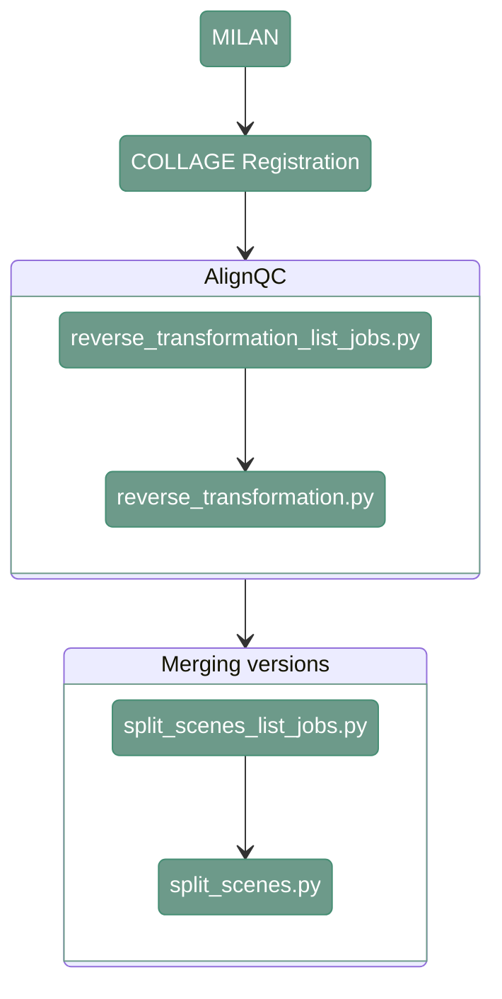

# Registration

---

<div align="center">



</div>

---

## 1. Overview

MILAN data require image registration. The registration is conducted using COLLAGE. Afterwards, it's quality is assessed with AlignQC model. 
Lastly, since MILAN allows for many versions of the same slide and round, the pipeline merge the available versions to achieve the highest quality of the output

---

## 2. COLLAGE registration

#### **Script 1:** [src/07_stitching_registration/run_collage.py](https://github.com/antoranzlab/DISSCOvery/blob/main/src/07_stitching_registration/run_collage.py) 

Registration for MILAN is conducted using COLLAGE. More information about COLLAGE can be found [here](https://www.biorxiv.org/content/10.1101/2024.07.15.603557v1)

```
python src/07_stitching_registration/run_collage.py \
    --input_path_tiles <path_to_split_scenes/> \
    --project_dir <path_to_output_registration/> \
    --reference_map_json <path_to_reference_map_json/> \
    --channel <registration_channel/> \
    --model_path <path_to_model/> \
    --n_cores <number_of_cores/> \
    --collage_python <path_to_python_executable/> \
    --collage_repo_dir <path_to_collage_repository/> \
    --run_qc <run_qc/> \
    --skip_existing <skip_existing/>
```

`--input_path_tiles`
: Path to the directory containing the split scenes used as input for registration. Example: `/path/to/project_directory/split_scenes/`

`--project_dir`
: Path to the output directory for registration results. Example: `/path/to/project_directory/output_registration/`

`--reference_map_json`
: Path to the JSON file containing the reference mapping between slides, rounds, and versions. Example: `/path/to/project_directory/reference_map_slide_round_version.json`

`--channel`
: Image channel used for registration. Example: `DAPI`

`--model_path`
: Path to the AlignQC model used during registration/QC. Example: `/path/to/disscovery/models/07_alignqc_mobilenetv4_shallow_keras3.h5`

`--n_cores`
: Number of CPU cores used for registration. Example: `8`

`--collage_python`
: Path to the Python executable used to run COLLAGE. Example: `sys.executable`

`--collage_repo_dir`
: Path to the COLLAGE repository. Example: `src/07_stitching_registration/collage_repo`

`--run_qc`
: Whether to run the registration QC step. Example: `True`

`--skip_existing`
: Whether to skip registration results that already exist. Example: `False`


---

## 3. Evaluate registration performance (AlgnQC)

#### **Script 1:** [src/07_stitching_registration/algnqc_list_jobs.py](https://github.com/antoranzlab/DISSCOvery/blob/main/src/07_stitching_registration/algnqc_list_jobs.py) 

This function lists all the paths for input and output files and generates a csv with the list of jobs that have to be run for QC evaluation

```
python src/07_stitching_registration/algnqc_list_jobs.py \
    --input_path_images <path_to_input_images/> \
    --output_folder_csv <path_to_output_csv_folder/> \
    --output_folder_html <path_to_output_html_folder/> \
    --output_folder_json <path_to_output_json_folder/> \
    --path_model <path_to_model/> \
    --ref_round <reference_round/> \
    --ref_version <reference_version/> \
    --ref_channel <reference_channel/> \
    --output_path_csv <path_to_joblist.csv/>
```

`--input_path_images`
: Path to the registered images produced by COLLAGE. Example: `/path/to/project_directory/output_registration/output_registration/`

`--output_folder_csv`
: Path to the output directory for AlignQC CSV results. Example: `/path/to/project_directory/output_registration_qc/csv/`

`--output_folder_html`
: Path to the output directory for AlignQC HTML results. Example: `/path/to/project_directory/output_registration_qc/html/`

`--output_folder_json`
: Path to the output directory for AlignQC JSON results. Example: `/path/to/project_directory/output_registration_qc/json/`

`--path_model`
: Path to the AlignQC model. Example: `/path/to/disscovery/models/07_alignqc_mobilenetv4_shallow_keras3.h5`

`--ref_round`
: Reference imaging round used for AlignQC. Example: `R01`

`--ref_version`
: Reference imaging version used for AlignQC. Example: `V01`

`--ref_channel`
: Reference channel used for AlignQC. Example: `DAPI`

`--output_path_csv`
: Path to the output CSV job list. Example: `/path/to/project_directory/algnqc_job_list.csv`

---

#### **Script 2:** [src/07_stitching_registration/evaluate_registration_algnqc.py](https://github.com/antoranzlab/DISSCOvery/blob/main/src/07_stitching_registration/evaluate_registration_algnqc.py) 

This script generates the QC figures to evaluate the registration.


```
python src/07_stitching_registration/evaluate_registration_algnqc.py \
    --path_ref_image <path_to_reference_image/> \
    --path_query_image <path_to_query_image/> \
    --path_model <path_to_model/> \
    --path_csv <path_to_output_csv/> \
    --path_html <path_to_output_html/> \
    --path_json <path_to_output_json/>
```

`--path_ref_image`
: Path to the reference image used for registration QC. Example: `/path/to/project_directory/output_registration/output_registration/test_R01_V01_ND_S0/test_R01_V01_BENCHMARK_ND_S0_DAPI.tiff`

`--path_query_image`
: Path to the query image being evaluated against the reference image. Example: `/path/to/project_directory/output_registration/output_registration/test_R02_V01_ND_S0/test_R02_V01_BENCHMARK_ND_S0_DAPI.tiff`

`--path_model`
: Path to the AlignQC model. Example: `/path/to/disscovery/models/07_alignqc_mobilenetv4_shallow_keras3.h5`

`--path_csv`
: Path to the output CSV file containing AlignQC results. Example: `/path/to/project_directory/output_registration_qc/csv/slide_R02_V01_DAPI.csv`

`--path_html`
: Path to the output HTML file containing the AlignQC report. Example: `/path/to/project_directory/output_registration_qc/html/slide_R02_V01_DAPI.html`

`--path_json`
: Path to the output JSON file containing AlignQC results. Example: `/path/to/project_directory/output_registration_qc/json/slide_R02_V01_DAPI.json`

---

## 4. Merge versions

#### **Script 1:** [src/07_stitching_registration/merge_versions_list_jobs.py](https://github.com/antoranzlab/DISSCOvery/blob/main/src/07_stitching_registration/merge_versions_list_jobs.py) 

This function lists all the paths for input and output files and generates a csv with the job list that have to be run for the merging script

```
python src/07_stitching_registration/merge_versions_list_jobs.py \
    --input_path_registration <path_to_registration_results/> \
    --input_path_algnqc <path_to_alignqc_results/> \
    --ref_version <reference_version/> \
    --output_path_folder <path_to_output_folder/> \
    --output_path_csv <path_to_joblist.csv/>
```

`--input_path_registration`
: Path to the registered images produced by COLLAGE. Example: `/path/to/project_directory/output_registration/output_registration/`

`--input_path_algnqc`
: Path to the directory containing AlignQC CSV results. Example: `/path/to/project_directory/output_registration_qc/csv/`

`--ref_version`
: Reference imaging version used to determine which registered images should be merged. Example: `V01`

`--output_path_folder`
: Path to the output directory for merged images. Example: `/path/to/project_directory/output_merged_images/`

`--output_path_csv`
: Path to the output CSV job list. Example: `/path/to/project_directory/merge_job_list.csv`

---

#### **Script 2:** [src/07_stitching_registration/merge_versions.py](https://github.com/antoranzlab/DISSCOvery/blob/main/src/07_stitching_registration/merge_versions.py) 

This script evaluates the registered images based on the alignQC output and merge the images into one version

```
python src/07_stitching_registration/merge_versions.py \
    --input_path_registration <path_to_registration_images/> \
    --input_path_algnqc <path_to_alignqc_results/> \
    --output_path_file <path_to_output_image/> \
    --feather_px <feathering_pixels/>
```

`--input_path_registration`
: Path to the registered images that will be merged. Example: `/path/to/project_directory/output_registration/output_registration/test_R03_V02_BENCHMARK_ND_S9/test_R03_V02_BENCHMARK_ND_S9_FITC.tiff`

`--input_path_algnqc`
: Path to the AlignQC results used to determine which registrations should be merged. Example: `/path/to/project_directory/output_registration_qc/csv/test_S9/test_R03_V01_BENCHMARK_ND_S9_DAPI.csv`

`--output_path_file`
: Path to the output merged image file. Example: `/path/to/project_directory/output_merged_images/test_R03_V01_BENCHMARK_ND_S9/test_R03_V01_BENCHMARK_ND_S9_FITC.tiff`

`--feather_px`
: Number of pixels used for feathering/blending image boundaries during merging. Example: `10`

---