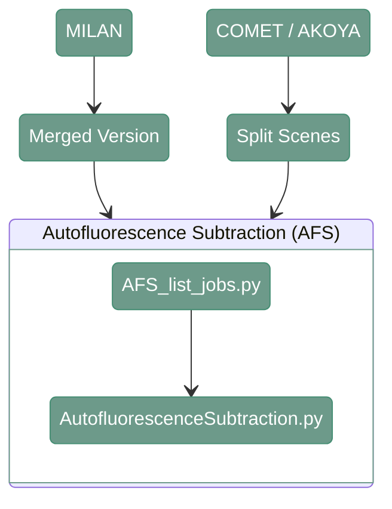

# Autofluorescence Subtraction (AFS)

---

<div align="center">



</div>

---

## 1. Overview


---

## 2. Autofluorescence Subtraction (AFS)

#### **Script 1:** [AFS_list_jobs.py](https://github.com/antoranzlab/DISSCOvery/blob/main/src/08_AFS/AFS_list_jobs.py) 

This function lists all the paths for input and output files and generates a csv with the list of jobs that have to be run for AFS

```
python src/08_AFS/AFS_list_jobs.py \
    --input_path_images <path_to_input_images/> \
    --input_path_medoids <path_to_medoids_csv/> \
    --output_folder <path_to_output_afs/> \
    --output_folder_qc <path_to_output_afs_qc/> \
    --exp_design_rounds <path_to_experimental_design_rounds/> \
    --output_path_csv <path_to_joblist.csv/>
```

`--input_path_images`
: Path to the directory containing the split scenes used as input for AFS. Example: `/path/to/project_directory/output_merged_images` (MILAN) or `/path/to/project_directory/split_scenes` (COMET/AKOYA)

`--input_path_medoids`
: Path to the CSV file containing the AFS medoid series. Example: `/path/to/disscovery/src/auxiliary_functions/AFS/medoid_series.csv`

`--output_folder`
: Path to the output directory for AFS images. Example: `/path/to/project_directory/output_AFS_images`

`--output_folder_qc`
: Path to the output directory for AFS QC results. Example: `/path/to/project_directory/output_AFS_QC`

`--exp_design_rounds`
: Path to the experimental design CSV containing round information. Example: `/path/to/project_directory/experimental_design/experimental_design_rounds.csv`

`--output_path_csv`
: Path to the output AFS job list CSV. Example: `/path/to/project_directory/afs_job_list.csv`

---

#### **Script 2:** [AutofluorescenceSubtraction.py](https://github.com/antoranzlab/DISSCOvery/blob/main/src/08_AFS/AutofluorescenceSubtraction.py) 

This script subtracts teh autofluorescence signal from the image. More details can be found [here](https://www.biorxiv.org/content/10.1101/2025.11.22.689928v1)


```
python src/08_AFS/AutofluorescenceSubtraction.py \
    --input_path_medoids <path_to_medoids_csv/> \
    --input_path_MS <path_to_ms_image/> \
    --input_path_AF <path_to_autofluorescence_image/> \
    --output_path_TS <path_to_output_subtracted_image/> \
    --output_path_QC <path_to_output_qc/>
```

`--input_path_medoids`
: Path to the CSV file containing the AFS medoid series. Example: `/path/to/disscovery/src/auxiliary_functions/AFS/medoid_series.csv`

`--input_path_MS`
: Path to the input multiplexed/signal image used for autofluorescence subtraction. Example: `/path/to/project_directory/output_merged_images/test_R02_V01_BENCHMARK_ND_S0/test_R02_V01_BENCHMARK_ND_S0_CY5.tiff` (MILAN) or `/path/to/project_directory/split_scenes/test_R02_V01_BENCHMARK_ND_S0/test_R02_V01_BENCHMARK_ND_S0_CY5.tiff` (COMET/AKOYA)

`--input_path_AF`
: Path to the corresponding autofluorescence image. Example: `/path/to/project_directory/output_merged_images/test_R01_V01_BENCHMARK_ND_S0/test_R01_V01_BENCHMARK_ND_S0_CY5.tiff` (MILAN) or `/path/to/project_directory/split_scenes/test_R01_V01_BENCHMARK_ND_S0/test_R01_V01_BENCHMARK_ND_S0_CY5.tiff` (COMET/AKOYA)

`--output_path_TS`
: Path to the output image after autofluorescence subtraction. Example: `/path/to/project_directory/output_AFS_images/test_R02_V01_BENCHMARK_ND_S0/test_R02_V01_BENCHMARK_ND_S0_CY5.tiff`

`--output_path_QC`
: Path to the output QC results for the autofluorescence subtraction. Example: `/path/to/project_directory/output_AFS_QC/marker_name/test_R02_V01_BENCHMARK_ND_S0_CY5.tiff`

---