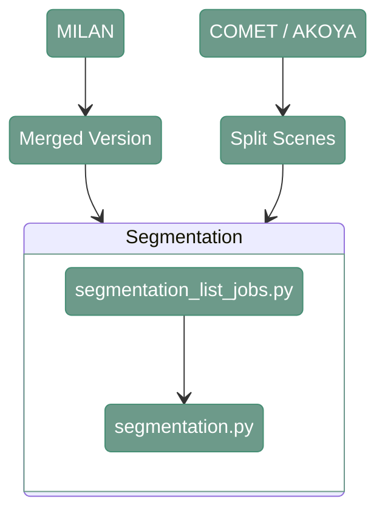

# Segmentation

---

<div align="center">



</div>

---

## 1. Overview

---

## 2. Segmentation

#### **Script 1:** [segmentation_list_jobs.py](https://github.com/antoranzlab/DISSCOvery/blob/main/src/09_segmentation/segmentation_list_jobs.py) 

This function resizes the input images, lists all the paths for input and output files and generates a csv with the list of jobs that have to be run for segmentation

```
python src/09_segmentation/segmentation_list_jobs.py \
    --input_path_images <path_to_input_images/> \
    --reference_map_json <path_to_reference_map_json/> \
    --output_folder <path_to_output_segmentation/> \
    --conversion_factor <conversion_factor/> \
    --path_model <path_to_model_directory/> \
    --model_name <segmentation_model_name/> \
    --pp <postprocessing/>
    --output_path_csv <path_to_joblist.csv/>
```

`--input_path_images`
: Path to the directory containing the split scenes used as input for segmentation. Example: `/path/to/project_directory/output_merged_images` (MILAN) or `/path/to/project_directory/split_scenes` (COMET/AKOYA)

`--reference_map_json`
: Path to the JSON file containing the reference mapping between slides, rounds, and versions. Example: `/path/to/project_directory/reference_map_slide_round_version.json`

`--output_folder`
: Path to the output directory for segmentation results. Example: `/path/to/project_directory/output_segmentation/`

`--conversion_factor`
: Conversion factor used to adjust the image resolution for segmentation. Example: `1` (MILAN), `2.321429` (COMET, it's a result of 0.65/0.28 calculation), `1.3` (AKOYA, it's a result of 0.65/0.5 calculation)

`--path_model`
: Path to the directory containing the segmentation models. Example: `/path/to/disscovery/models/09_models/`

`--model_name`
: Name of the segmentation model to use. Example: `stardist`

`--pp`
: Whether to enable segmentation post-processing. Example: `True`

`--output_path_csv`
: Path to the output CSV job list. Example: `/path/to/project_directory/cell_segmentation_joblist.csv`

---

#### **Script 2:** [segmentation_list_jobs.py](https://github.com/antoranzlab/DISSCOvery/blob/main/src/09_segmentation/segmentation.py) 

This script performs cell segmentation using either [StarDist](https://github.com/stardist/stardist) or [Cellpose](https://www.nature.com/articles/s41592-020-01018-x)

```
python src/09_segmentation/segmentation.py \
    --path_to_the_image <path_to_input_image/> \
    --path_to_the_models <path_to_model_directory/> \
    --model_name <segmentation_model_name/> \
    --output_path <path_to_output_segmentation/> \
    --QC_path <path_to_output_qc/> \
    --PP <postprocessing/>
```

`--path_to_the_image`
: Path to the input image to be segmented. Example: `/path/to/project_directory/output_segmentation/Resized/test_R01_V01_BENCHMARK_ND_S0/test_R01_V01_BENCHMARK_ND_S0_DAPI.tiff`

`--path_to_the_models`
: Path to the directory containing the segmentation models. Example: `/path/to/disscovery/models/09_models/`

`--model_name`
: Name of the segmentation model to use. Example: `stardist`

`--output_path`
: Path to the output segmentation result. Example: `/path/to/project_directory/output_segmentation/Matrix/test_R01_V01_BENCHMARK_ND_S0/test_R01_V01_BENCHMARK_ND_S0_DAPI.npy`

`--QC_path`
: Path to the output QC directory or file. Example: `/path/to/project_directory/output_segmentation/QC/test/test_R01_V01_BENCHMARK_ND_S0_DAPI.tif`

`--PP`
: Whether to enable segmentation post-processing. Example: `True`

---