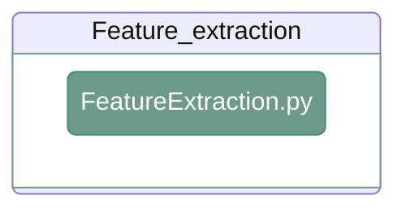

# Feature extraction

---

<div align="center">



</div>

---

## 1. Overview

---

## 2. Feature extraction

#### **Script 1:** [FeatureExtraction.py](https://github.com/antoranzlab/DISSCOvery/blob/main/src/10_feature_extraction/FeatureExtraction.py) 

This quantifies the signal for each slide and scene.

```
python src/10_feature_extraction/FeatureExtraction.py \
    --path_input_AFS <path_to_afs_images/> \
    --path_exp_design_rounds <path_to_experimental_design_rounds/> \
    --path_input_seg <path_to_segmentation_results/> \
    --ref_round <reference_round/> \
    --path_output_csv <path_to_output_feature_extraction/>
```

`--path_input_AFS`
: Path to the directory containing the autofluorescence-subtracted images. Example: `/path/to/project_directory/output_AFS_images/`

`--path_exp_design_rounds`
: Path to the experimental design file containing round information. Example: `/path/to/project_directory/experimental_design/experimental_design_rounds.csv`

`--path_input_seg`
: Path to the directory containing the segmentation results used for feature extraction. Example: `/path/to/project_directory/output_segmentation/Matrix/`

`--ref_round`
: Reference imaging round used for feature extraction. Example: `R01`

`--path_output_csv`
: Path to the output directory for the feature-extraction CSV files. Example: `/path/to/project_directory/output_feature_extraction/`

---