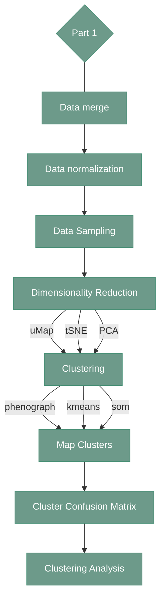

# Cell identification - Part 1

---

<div align="center">



</div>

---

## 1. Overview

!!! note
    Cell identification in the software is prepared to be run multiple times - it gives the user the possibility of reclustering, filtering the selected markers, or rerunning annotations.
Data merging is done only since, therefore is written down in the main `output_cell_identification` folder. 
Normalization and sampling can be redone if the user wishes to change the sample of normalization mode.
Their output is saved in the node folder, `n0X`. The scripts used after normalization and sampling uses a subfolder of `n0X`, `v01`, to write down the output. 

---

## 2. Data merge

#### **Script 1:** [MergeData.py](https://github.com/antoranzlab/DISSCOvery/blob/main/src/11_cell_identification/MergeData.py) 

This function takes all the csvs listed in input folder, filters the scenes from the input with positive quality control flag and saves the data in csv file. 
Additionally, it generates an output.qc file that ensures successful execution of the subsequential scripts

```
python src/11_cell_identification/MergeData.py \
    --path.input.folder <path_to_feature_extraction/> \
    --path.output.csv <path_to_output_merged_data/>
```

`--path.input.folder`
: Path to the directory containing the feature-extraction results to be merged. Example: `/path/to/project_directory/output_feature_extraction/`

`--path.output.csv`
: Path to the output merged data file. Example: `/path/to/project_directory/output_cell_identification/df_data_merged.parquet`

---

#### **Script 2:** [DataNormalization.py](https://github.com/antoranzlab/DISSCOvery/blob/main/src/11_cell_identification/DataNormalization.py) 

It takes the csv or parquet file created with `MergeData.py` and if the variable normalization.yes.no is set to 1,  it normalizes mean fluorescence intensity (MFI) values to z-scores.
The normalization is performed per scene. Z-scores are later trimmed into the [-5, +5] range. If normalization.yes.no is set to 0, the script saves the values in csv/parquet without normalization.


```
python src/11_cell_identification/DataNormalization.py \
    --path.input.csv <path_to_input_merged_data/> \
    --normalization.yes.no <normalization_yes_or_no/> \
    --normalization.scope <normalization_scope/> \
    --path.output.csv <path_to_output_normalized_data/>
```

`--path.input.csv`
: Path to the merged feature-extraction data file. Example: `/path/to/project_directory/output_cell_identification/df_data_merged.parquet`

`--normalization.yes.no`
: Whether normalization should be applied to the data. Example: `1` (yes) or `0` (no normalization)

`--normalization.scope`
: Scope over which normalization is performed. Example: `sample` or `global`

`--path.output.csv`
: Path to the output normalized data file. Example: `/path/to/project_directory/output_cell_identification/n01/df_data_norm.parquet`

---

#### **Script 3:** [DataSampling.py](https://github.com/antoranzlab/DISSCOvery/blob/main/src/11_cell_identification/DataSampling.py) 

This function takes the csv/parquet file created with `DataNormalization.py` and if the variable `sampling.yes.no` is set to 1, it samples the number of cells defined in `number.of.cells` following a stratified random sampling approach.
If the number of cells to be sampled are more than the total number of cells, the total number of cells is taken. If `sampling.yes.no` is set to 0, it saves the csv/parquet without sampling.


```
python src/11_cell_identification/DataSampling.py \
    --path.input.csv <path_to_input_normalized_data/> \
    --path.output.csv <path_to_output_sampled_data/> \
    --sampling.yes.no <sampling_yes_no/> \
    --number.of.cells <number_of_cells/> \
    --selected.seed <sampling_seed/>
```

`--path.input.csv`
: Path to the normalized cell-level data generated by the data normalization step. Example: `/path/to/project_directory/output_cell_identification/n01/df_data_norm.parquet`

`--path.output.csv`
: Path to the output file containing the sampled cell-level data. Example: `/path/to/project_directory/output_cell_identification/n01/df_data_sampled.parquet`

`--sampling.yes.no`
: Whether cell-level sampling should be performed. Example: `1` (yes) or `0` (no sampling)

`--number.of.cells`
: Number of cells to sample when sampling is enabled. Example: `15000`

`--selected.seed`
: Random seed used to ensure reproducible sampling. Example: `1234`

---

#### **Script 4:** [DimensionalityReduction.py](https://github.com/antoranzlab/DISSCOvery/blob/main/src/11_cell_identification/DimensionalityReduction.py) 

Using the sampled data, the set of user-selected markers are taken and a dimensionality reduction (DR) method is applied (to be chosen between PCA, t-SNE, and uMap).

!!! warning
    This function should be executed 3 times, once per dimensionality reduction method

```
python src/11_cell_identification/DimensionalityReduction.py \
    --input.marker.list <path_to_phenotypic_markers/> \
    --path.input.csv <path_to_input_sampled_data/> \
    --path.output.csv <path_to_output_umap_csv/> \
    --path.output.model <path_to_output_umap_model/> \
    --dimensionality.reduction.method <dimensionality_reduction_method/> \
    --selected.seed <random_seed/>
```

`--input.marker.list`
: Path to the CSV file containing the list of phenotypic markers to use for dimensionality reduction. Example: `/path/to/project_directory/phenotypic_markers.csv`
    The `phenotypic_markers.csv` file should have `marker_id` as column name, and each row should contain a marker name. Example of  the`phenotypic_markers.csv`:

```
marker_id
SOX
CD4
CD8
FOXP3
```

`--path.input.csv`
: Path to the sampled cell-level data. Example: `/path/to/project_directory/output_cell_identification/n01/df_data_sampled.parquet`

`--path.output.csv`
: Path to the output file containing the UMAP-reduced data. Example: `/path/to/project_directory/output_cell_identification/n01/v01/uMap.parquet`

`--path.output.model`
: Path to the output RDS file containing the dimensionality-reduction model/results. Example: `/path/to/project_directory/output_cell_identification/n01/v01/uMap.rds`

`--dimensionality.reduction.method`
: Dimensionality reduction method to apply. Example: `uMap`, `PCA` or `tsne`

`--selected.seed`
: Random seed used for reproducible dimensionality reduction. Example: `1234`

---

#### **Script 5:** [Clustering.py](https://github.com/antoranzlab/DISSCOvery/blob/main/src/11_cell_identification/Clustering.py) 

Using the sampled data, the set of user-selected markers are taken and a clustering method is applied (to be chosen between phenograph, kmeans, and som).
DISSCOvery utilizes the [CONCLAVE](https://www.biorxiv.org/content/10.1101/2025.11.13.688190v1) approach, therefore the clustering is applied multiple times using different methods. 
In later steps, after all clustering are annotated, the consensus is defined and projected to full dataset

!!! warning
    This function should be executed 3 times, once per clustering method. Additionally, the first clustering method should be phenograph,
because it will define the number of cluster necessary for kmeans and som


```
python src/11_cell_identification/Clustering.py \
    --input.marker.list <path_to_phenotypic_markers/> \
    --path.input.csv <path_to_input_sampled_data/> \
    --path.output.csv <path_to_output_clusters/> \
    --clustering.method <clustering_method/> \
    --selected.seed <random_seed/>
    --number.of.clusters <n_clusters/> 
```

`--input.marker.list`
: Path to the CSV file containing the list of phenotypic markers used for clustering. Example: `/path/to/project_directory/phenotypic_markers.csv`

`--path.input.csv`
: Path to the sampled cell-level data used for clustering. Example: `/path/to/project_directory/output_cell_identification/n01/df_data_sampled.parquet`

`--path.output.csv`
: Path to the output file containing the Phenograph cluster assignments. Example: `/path/to/project_directory/output_cell_identification/n01/v01/phenograph.parquet`

`--clustering.method`
: Clustering method to apply. Example: `phenograph`, `kmeans` or `som`

`--selected.seed`
: Random seed used for reproducible clustering. Example: `1234`

`--number.of.clusters`
: Number of clusters for kmeans and som. For phenograph this argument should not be provided. Example: `20`

---

#### **Script 6:** [MapClusters.py](https://github.com/antoranzlab/DISSCOvery/blob/main/src/11_cell_identification/MapClusters.py) 

Using the sampled data, the set of user-selected markers are taken and a clustering method is applied (to be chosen between phenograph, kmeans, and som).

!!! warning
    This function should be executed 3 times, once per each clustering output from the previous script (phenograph, kmeans, som)


```
python src/11_cell_identification/MapClusters.py \
    --input.marker.list <path_to_phenotypic_markers/> \
    --path.input.full.data <path_to_input_full_data/> \
    --path.input.umap <path_to_umap_data/> \
    --path.input.umap.model <path_to_umap_model/> \
    --path.input.cluster <path_to_input_clusters/> \
    --path.output.csv <path_to_output_mapped_clusters/> \
    --knn.n.neighbors <number_of_knn_neighbors/> \
    --prediction.high.confidence <high_confidence_threshold/> \
    --prediction.medium.confidence <medium_confidence_threshold/>
```

`--input.marker.list`
: Path to the CSV file containing the list of phenotypic markers used for cluster mapping. Example: `/path/to/project_directory/phenotypic_markers.csv`

`--path.input.full.data`
: Path to the full normalized cell-level dataset used for cluster prediction. Example: `/path/to/project_directory/output_cell_identification/n01/df_data_norm.parquet`

`--path.input.umap`
: Path to the UMAP-reduced data used as the reference embedding. Example: `/path/to/project_directory/output_cell_identification/n01/v01/uMap.parquet`

`--path.input.umap.model`
: Path to the UMAP model corresponding to the reference embedding. Example: `/path/to/project_directory/output_cell_identification/n01/v01/uMap.rds`

`--path.input.cluster`
: Path to the input cluster assignments that will be mapped to the full dataset. Example: `/path/to/project_directory/output_cell_identification/n01/v01/phenograph.parquet`

`--path.output.csv`
: Path to the output file containing the mapped cluster assignments. Example: `/path/to/project_directory/output_cell_identification/n01/v01/phenograph_mapped_clusters.parquet`

`--knn.n.neighbors`
: Number of nearest neighbors used for mapping clusters to the full dataset. Example: `25`

`--prediction.high.confidence`
: Confidence threshold used to classify a cluster prediction as high confidence. Example: `0.8`

`--prediction.medium.confidence`
: Confidence threshold used to classify a cluster prediction as medium confidence. Example: `0.6`

---

#### **Script 7:** [ClusterConfusionMatrix.py](https://github.com/antoranzlab/DISSCOvery/blob/main/src/11_cell_identification/ClusterConfusionMatrix.py) 

Creates a confusion matrix for the clustering outputs

!!! note
    This scripts is used twice in the pipeline, first time before generating the annotations dictionary, and second time in the Part 2 after annotations. 
Here it will be used in the `cluserts` mode. 

```
python src/11_cell_identification/ClusterConfusionMatrix.py \
    --mode <analysis_mode/> \
    --path.input.phenograph <path_to_phenograph_clusters/> \
    --path.input.kmeans <path_to_kmeans_clusters/> \
    --path.input.som <path_to_som_clusters/> \
    --path.output.csv <path_to_output_confusion_matrix/>
```

`--mode`
: Specifies the type of analysis to perform. When run for the first time during the analysis, the required mode is "clusters". Example: `clusters`

`--path.input.phenograph`
: Path to the mapped Phenograph cluster assignments. Example: `/path/to/project_directory/output_cell_identification/n01/v01/phenograph_mapped_clusters.parquet`

`--path.input.kmeans`
: Path to the mapped K-means cluster assignments. Example: `/path/to/project_directory/output_cell_identification/n01/v01/kmeans_mapped_clusters.parquet`

`--path.input.som`
: Path to the mapped SOM cluster assignments. Example: `/path/to/project_directory/output_cell_identification/n01/v01/som_mapped_clusters.parquet`

`--path.output.csv`
: Path to the output file containing the cluster confusion matrix. Example: `/path/to/project_directory/output_cell_identification/n01/v01/confusion_matrix_clusters.parquet`

---

#### **Script 8:** [ClusteringAnalysis_updated.py](https://github.com/antoranzlab/DISSCOvery/blob/main/src/11_cell_identification/ClusteringAnalysis_updated.py) 

In the software, the results from `DimensionalityReduction.py` and `Clustering.py `are evaluated and several graphs are generated to be displayed on the GUI. Each graph is then annotated by a user.
All annotations, for each clustering method are later merged together into one `annotation_dictionary.csv` file.


Outside the software the user first runs `ClusteringAnalysis_updated.py` to create the plots and `annotation_dictionary.csv` file.
Then they use the plots to properly annotate `annotation_dictionary.csv` for the Part 2 of the cell annotation.

```
python src/11_cell_identification/ClusteringAnalysis_updated.py \
    --mode <analysis_mode/> \
    --input.marker.list <path_to_phenotypic_markers/> \
    --path.input.csv <path_to_input_sampled_data/> \
    --path.input.pca <path_to_pca_data/> \
    --path.input.tsne <path_to_tsne_data/> \
    --path.input.umap <path_to_umap_data/> \
    --path.input.phenograph <path_to_phenograph_clusters/> \
    --path.input.kmeans <path_to_kmeans_clusters/> \
    --path.input.som <path_to_som_clusters/> \
    --path.annotation.dictionary <path_to_annotation_dictionary/> \
    --generate.marker.plots <generate_marker_plots/> \
    --path.output.folder <path_to_output_folder/> \
    --path.input.mapped.phenograph <path_to_mapped_phenograph_clusters/> \
    --path.input.mapped.kmeans <path_to_mapped_kmeans_clusters/> \
    --path.input.mapped.som <path_to_mapped_som_clusters/> \
    --generate.spatial.plots <generate_spatial_plots/> \
    --spatial.max.points.per.plot <maximum_points_per_plot/> \
    --selected.seed <random_seed/> \
    --update.heatmaps <update_heatmaps/> \
    --update.enrichment <update_enrichment/> \
    --update.dr.plots <update_dr_plots/> \
    --update.spatial.plots <update_spatial_plots/> \
    --write.json <write_json/> \
    --write.html <write_html/>
```

`--mode`
: Analysis mode. For this rule, the analysis is run in build mode. Example: `build`

`--input.marker.list`
: Path to the CSV file containing the phenotypic marker list. Example: `/path/to/project_directory/phenotypic_markers.csv`

`--path.input.csv`
: Path to the sampled cell-level data. Example: `/path/to/project_directory/output_cell_identification/n01/df_data_sampled.parquet`

`--path.input.pca`
: Path to the PCA-reduced data. Example: `/path/to/project_directory/output_cell_identification/n01/v01/PCA.parquet`

`--path.input.tsne`
: Path to the t-SNE-reduced data. Example: `/path/to/project_directory/output_cell_identification/n01/v01/tsne.parquet`

`--path.input.umap`
: Path to the UMAP-reduced data. Example: `/path/to/project_directory/output_cell_identification/n01/v01/uMap.parquet`

`--path.input.phenograph`
: Path to the Phenograph cluster assignments. Example: `/path/to/project_directory/output_cell_identification/n01/v01/phenograph.parquet`

`--path.input.kmeans`
: Path to the K-means cluster assignments. Example: `/path/to/project_directory/output_cell_identification/n01/v01/kmeans.parquet`

`--path.input.som`
: Path to the SOM cluster assignments. Example: `/path/to/project_directory/output_cell_identification/n01/v01/som.parquet`

`--path.annotation.dictionary`
: Path to the annotation dictionary used to map cluster annotations. Example: `/path/to/project_directory/output_cell_identification/n01/v01/annotation_dictionary.csv`

`--generate.marker.plots`
: Whether marker plots should be generated. Example: `1` (generate) or `0` (no plots)

`--path.output.folder`
: Directory where clustering analysis results are written. Example: `/path/to/project_directory/output_cell_identification/n01/v01/`

`--path.input.mapped.phenograph`
: Path to the mapped Phenograph cluster assignments. Example: `/path/to/project_directory/output_cell_identification/n01/v01/phenograph_mapped_clusters.parquet`

`--path.input.mapped.kmeans`
: Path to the mapped K-means cluster assignments. Example: `/path/to/project_directory/output_cell_identification/n01/v01/kmeans_mapped_clusters.parquet`

`--path.input.mapped.som`
: Path to the mapped SOM cluster assignments. Example: `/path/to/project_directory/output_cell_identification/n01/v01/som_mapped_clusters.parquet`

`--generate.spatial.plots`
: Whether spatial plots should be generated. Example: `1` (generate) or `0` (no plots)

`--spatial.max.points.per.plot`
: Maximum number of points to include in each spatial plot. Example: `200000`

`--selected.seed`
: Random seed used for reproducible analysis and plotting. Example: `1234`

`--update.heatmaps`
: Whether existing heatmaps should be updated. Set to 0 in this rule. Example: `0`

`--update.enrichment`
: Whether existing enrichment results should be updated. Set to 0 in this rule. Example: `0`

`--update.dr.plots`
: Whether existing dimensionality-reduction plots should be updated. Set to 0 in this rule. Example: `0`

`--update.spatial.plots`
: Whether existing spatial plots should be updated. Set to 0 in this rule. Example: `0`

`--write.json`
: Whether JSON output should be written. Set to 0 in this rule. Example: `0`

`--write.html`
: Whether HTML output should be written. Set to 1 in this rule. Example: `1`

---

#### **Script 9:** Clusters annotation

Before moving to the second part of the cell identification, generated clusters, save in the `annotation_dictionary.csv` has to be annotated.

To do this, users has to use the plots generated in the previous step (the most important are the plots located in the `heatmaps_cluster_level` and `marker_expression` subfolders)
to evaluate the markers expressed in each cluster and assigned them to specific cell type. If a cluster has strong expression of unrelated markers, the user should assign it as 'Mix'.
If none of the markers are expressed in certain cluster the user should assign it as 'Blank'

Below the example of the dictionary before annotation

```
cl_method   cluster annotation
kmeans      0       0
kmeans      1       1
kmeans      11      11
kmeans      12      12
```

The annotation should be provided in the 'annotation columns'. Example:

```
cl_method   cluster annotation
kmeans      0       T-cell
kmeans      1       Blank
kmeans      11      Tumor
kmeans      12      Tumor
```

All clustering methods have to be annotated and the annotations names needs to be consistent. For example, in later steps the pipeline will treat 'T-cell' and 'tcells' as two separate cell types. 
This difference will affect the final annotations. For instance, if there are very few 'tcells' annotations in the whole dictionary, this label may be treated as outlier, and it will be dropped, while properly labeled 'T-cell' will remain in the dataset.  