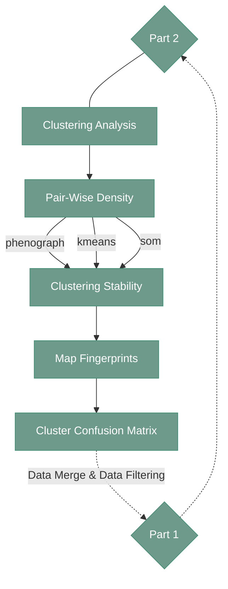

# Cell identification - Part 2

---

<div align="center">



</div>

---

## 1. Overview

Part 2 of cell identification asses teh annotations done after Part 1, projects the annotations into whole data set and summarize teh results. 
If the user want to subcluster some cell types they can filter out the cell type of interest and repeat the cell identification process. 

---

## 2. Clustering Analysis - after annotations

#### **Script 1:** [ClusteringAnalysis_updated.py](https://github.com/antoranzlab/DISSCOvery/blob/main/src/11_cell_identification/ClusteringAnalysis_updated.py) 

This part of the pipeline begins with last scripts form part 2. The aim is to update figures and clusters using the provided annotations. 

```
python src/11_cell_identification/ClusteringAnalysis_updated.py \
    --mode <analysis_mode/> \
    --input.marker.list <path_to_phenotypic_markers/> \
    --path.input.csv <path_to_input_sampled_data/> \
    --path.input.pca <path_to_pca_data/> \
    --path.input.tsne <path_to_tsne_data/> \
    --path.input.umap <path_to_umap_data/> \
    --path.input.phenograph <path_to_phenograph_clusters/> \
    --path.input.kmeans <path_to_kmeans_clusters/> \
    --path.input.som <path_to_som_clusters/> \
    --path.annotation.dictionary <path_to_annotation_dictionary/> \
    --generate.marker.plots <generate_marker_plots/> \
    --path.output.folder <path_to_output_folder/> \
    --path.input.mapped.phenograph <path_to_mapped_phenograph_clusters/> \
    --path.input.mapped.kmeans <path_to_mapped_kmeans_clusters/> \
    --path.input.mapped.som <path_to_mapped_som_clusters/> \
    --generate.spatial.plots <generate_spatial_plots/> \
    --spatial.max.points.per.plot <maximum_points_per_plot/> \
    --selected.seed <random_seed/> \
    --update.heatmaps <update_heatmaps/> \
    --update.enrichment <update_enrichment/> \
    --update.dr.plots <update_dr_plots/> \
    --update.spatial.plots <update_spatial_plots/> \
    --write.json <write_json/> \
    --write.html <write_html/>
```

`--mode`
: Analysis mode. For this rule, existing clustering analysis results are updated. Example: `update`

`--input.marker.list`
: Path to the CSV file containing the phenotypic marker list. Example: `/path/to/project_directory/phenotypic_markers.csv`

`--path.input.csv`
: Path to the sampled cell-level data. Example: `/path/to/project_directory/output_cell_identification/n01/df_data_sampled.parquet`

`--path.input.pca`
: Path to the PCA-reduced data. Example: `/path/to/project_directory/output_cell_identification/n01/v01/PCA.parquet`

`--path.input.tsne`
: Path to the t-SNE-reduced data. Example: `/path/to/project_directory/output_cell_identification/n01/v01/tsne.parquet`

`--path.input.umap`
: Path to the UMAP-reduced data. Example: `/path/to/project_directory/output_cell_identification/n01/v01/uMap.parquet`

`--path.input.phenograph`
: Path to the Phenograph cluster assignments. Example: `/path/to/project_directory/output_cell_identification/n01/v01/phenograph.parquet`

`--path.input.kmeans`
: Path to the K-means cluster assignments. Example: `/path/to/project_directory/output_cell_identification/n01/v01/kmeans.parquet`

`--path.input.som`
: Path to the SOM cluster assignments. Example: `/path/to/project_directory/output_cell_identification/n01/v01/som.parquet`

`--path.annotation.dictionary`
: Path to the annotation dictionary used for cluster annotations. Example: `/path/to/project_directory/output_cell_identification/n01/v01/annotation_dictionary.csv`

`--generate.marker.plots`
: Whether marker plots should be generated. Example: `1` (generate) or `0` (no plots)

`--path.output.folder`
: Directory containing the clustering analysis results to be updated. Example: `/path/to/project_directory/output_cell_identification/n01/v01/`

`--path.input.mapped.phenograph`
: Path to the mapped Phenograph cluster assignments. Example: `/path/to/project_directory/output_cell_identification/n01/v01/phenograph_mapped_clusters.parquet`

`--path.input.mapped.kmeans`
: Path to the mapped K-means cluster assignments. Example: `/path/to/project_directory/output_cell_identification/n01/v01/kmeans_mapped_clusters.parquet`

`--path.input.mapped.som`
: Path to the mapped SOM cluster assignments. Example: `/path/to/project_directory/output_cell_identification/n01/v01/som_mapped_clusters.parquet`

`--generate.spatial.plots`
: Whether spatial plots should be generated. Example: `1` (generate) or `0` (no plots)

`--spatial.max.points.per.plot`
: Maximum number of points included in each spatial plot. Example: `200000`

`--selected.seed`
: Random seed used for reproducible analysis and plotting. Example: `1234`

`--update.heatmaps`
: Whether heatmap results should be updated. Set to 1 in this rule. Example: `1`

`--update.enrichment`
: Whether enrichment results should be updated. Set to 1 in this rule. Example: `1`

`--update.dr.plots`
: Whether dimensionality-reduction plots should be updated. Set to 1 in this rule. Example: `1`

`--update.spatial.plots`
: Whether spatial plots should be updated. Set to 1 in this rule. Example: `1`

`--write.json`
: Whether JSON output should be written. Set to 0 in this rule. Example: `0`

`--write.html`
: Whether HTML output should be written. Set to 1 in this rule. Example: `1`

---

#### **Script 2:** [PreComputePairWiseDensity.py](https://github.com/antoranzlab/DISSCOvery/blob/main/src/11_cell_identification/PreComputePairWiseDensity.py) 

Creates pairwise density plots for each cluster

!!! warning
    This function should be executed 3 times, once per clustering method

```
python src/11_cell_identification/PreComputePairWiseDensity.py \
    --input.marker.list <path_to_phenotypic_markers/> \
    --path.input.csv <path_to_input_sampled_data/> \
    --path.input.cluster <path_to_input_clusters/> \
    --path.output.folder <path_to_output_density_folder/> \
    --top.n.markers <number_of_top_markers/> \
    --bins <number_of_bins/>
```

`--input.marker.list`
: Path to the CSV file containing the phenotypic marker list. Example: `/path/to/project_directory/phenotypic_markers.csv`

`--path.input.csv`
: Path to the sampled cell-level data used for pairwise density calculation. Example: `/path/to/project_directory/output_cell_identification/n01/df_data_sampled.parquet`

`--path.input.cluster`
: Path to the cluster assignments used for pairwise density calculation. Example: `/path/to/project_directory/output_cell_identification/no01/v01/phenograph.parquet`

`--path.output.folder`
: Directory where pairwise density results are stored. Example: `/path/to/project_directory/output_cell_identification/n01/v01/pairwise_density/phenograph/`

`--top.n.markers`
: Number of top markers used for the pairwise density analysis. Example: `10`

`--bins`
: Number of bins used to calculate the pairwise density distributions. Example: `96`

---

#### **Script 3:** [ClusteringStability.py](https://github.com/antoranzlab/DISSCOvery/blob/main/src/11_cell_identification/ClusteringStability.py) 

This function evaluates the annotations made for each cluster in each clustering method and builds the consensus.

```
python src/11_cell_identification/ClusteringStability.py \
    --path.input.phenograph <path_to_phenograph_clusters/> \
    --path.input.kmeans <path_to_kmeans_clusters/> \
    --path.input.som <path_to_som_clusters/> \
    --path.annotation.dictionary <path_to_annotation_dictionary/> \
    --path.output.folder <path_to_output_folder/>
```

`--path.input.phenograph`
: Path to the Phenograph cluster assignments used for the stability analysis. Example: `/path/to/project_directory/output_cell_identification/n01/v01/phenograph.parquet`

`--path.input.kmeans`
: Path to the K-means cluster assignments used for the stability analysis. Example: `/path/to/project_directory/output_cell_identification/n01/v01/kmeans.parquet`

`--path.input.som`
: Path to the SOM cluster assignments used for the stability analysis. Example: `/path/to/project_directory/output_cell_identification/n01/v01/som.parquet
`
`--path.annotation.dictionary`
: Path to the annotation dictionary used to map cluster annotations. Example: `/path/to/project_directory/output_cell_identification/n01/v01/annotation_dictionary.csv`

`--path.output.folder`
: Directory where clustering stability results are written. Example: `/path/to/project_directory/output_cell_identification/n01/v01/`

---

#### **Script 4:** [MapFingerprints.py](https://github.com/antoranzlab/DISSCOvery/blob/main/src/11_cell_identification/MapFingerprints.py) 

This function projects the annotations to the whole dataset

```
python src/11_cell_identification/MapFingerprints.py \
    --input.marker.list <path_to_phenotypic_markers/> \
    --path.input.full.data <path_to_input_normalized_data/> \
    --path.input.consensus <path_to_consensus_data/> \
    --path.output.folder <path_to_output_folder/> \
    --node.id <cell_identification_node_id/> \
    --version.id <cell_identification_version_id/> \
    --max.cells.per.celltype <maximum_cells_per_celltype/> \
    --umap.n.neighbors <umap_number_of_neighbors/> \
    --umap.min.dist <umap_minimum_distance/> \
    --knn.n.neighbors <knn_number_of_neighbors/> \
    --selected.seed <random_seed/> \
    --refine.min.confidence <minimum_refinement_confidence/> \
    --refine.min.margin <minimum_refinement_margin/> \
    --prediction.high.confidence <high_confidence_threshold/> \
    --prediction.medium.confidence <medium_confidence_threshold/> \
    --write.per.sample.files <write_per_sample_files/>
```

`--input.marker.list`
: Path to the CSV file containing the phenotypic marker list. Example: `/path/to/project_directory/phenotypic_markers.csv`

`--path.input.full.data`
: Path to the full normalized cell-level dataset. Example: `/path/to/project_directory/output_cell_identification/n01/df_data_norm.parquet`

`--path.input.consensus`
: Path to the consensus clustering data used to map cell fingerprints. Example: `/path/to/project_directory/output_cell_identification/n01/v01/df_data_consensus.parquet`

`--path.output.folder`
: Directory where the fingerprint mapping results are written. Example: `/path/to/project_directory/output_cell_identification/n01/v01/`

`--node.id`
: Identifier of the cell-identification analysis node. Example: `n01`

`--version.id`
: Identifier of the cell-identification analysis version. Example: `v01`

`--max.cells.per.celltype`
: Maximum number of cells sampled per cell type when constructing fingerprints. Example: `2500`

`--umap.n.neighbors`
: Number of neighboring points used by UMAP. Example: `15`

`--umap.min.dist`
: Minimum distance parameter controlling the compactness of UMAP embeddings. Example: `0.1`

`--knn.n.neighbors`
: Number of nearest neighbors used for cluster or fingerprint mapping. Example: `25`

`--selected.seed`
: Random seed used for reproducible mapping and sampling. Example: `1234`

`--refine.min.confidence`
: Minimum prediction confidence required for refinement. Example: `0.6`

`--refine.min.margin`
: Minimum confidence margin required between competing predictions during refinement. Example: `0.1`

`--prediction.high.confidence`
: Confidence threshold for high-confidence predictions. Example: `0.8`

`--prediction.medium.confidence`
: Confidence threshold for medium-confidence predictions. Example: `0.6`

`--write.per.sample.files`
: Whether per-sample output files should be written. Example: `1` (yes) or `0` (no)

---

#### **Script 5:** [ClusterConfusionMatrix.py](https://github.com/antoranzlab/DISSCOvery/blob/main/src/11_cell_identification/ClusterConfusionMatrix.py) 

Creates a confusion matrix for the clustering outputs

!!! note
    This scripts is used twice in the pipeline, first time before generating the annotations dictionary, and second time in the Part 2 after annotations. 
Here it will be used in the `annotated` mode. 

```
python src/11_cell_identification/ClusterConfusionMatrix.py \
    --mode <analysis_mode/> \
    --path.input.annotated <path_to_annotated_predictions/> \
    --label.col <label_column/> \
    --method.label <label_method/> \
    --path.output.csv <path_to_output_confusion_matrix/>
```

`--mode`
: Specifies the type of confusion matrix analysis to perform. For this rule, annotated predictions are used. Example: `annotated`

`--path.input.annotated`
: Path to the fingerprint predictions containing the annotated cell-type assignments. Example: `/path/to/project_directory/output_cell_identification/n01/v01/fingerprint_mapping/fingerprint_predictions.parquet`

`--label.col`
: Column containing the cell-type labels used for the confusion matrix. Example: `CellType`

`--method.label`
: Labeling method used to define the reference labels. For this rule, consensus labels are used. Example: `consensus`

`--path.output.csv`
: Path to the output file containing the cluster confusion matrix. Example: `/path/to/project_directory/output_cell_identification/n01/v01/confusion_matrix_clusters.parquet`

---
