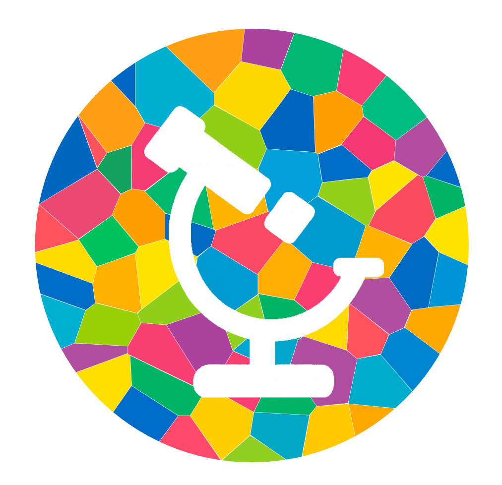

# Welcome to DISSCOvery

DISSCovery is an interactive image analysis platform that allows for high-quality processing of the images acquired with MILAN, COMET, and PhenoCycler-Fusion (AKOYA).
It utilizes state-of-the-art tools for flat-field correction, tissue detection, artifact recognition, tile stitching, cycle registration, autofluorescence subtraction, cell segmentation, and consensus cell phenotyping.

