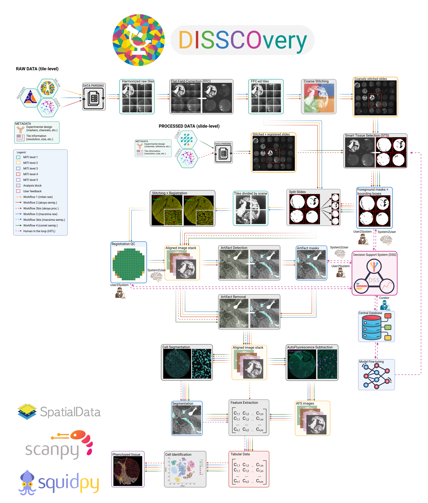

# DISSCOvery

  

[//]: # (## Installation)

Here goes the text about how great disscovery is

## Usage
Tutorials for the software are available [here](tutorials). 

Detailed information regarding the scripts per each technology can be found [here](technologies). All the scripts are located in the [source](../src) subfolder and all required, pre-trained models can be found [here](models).

## Authors and acknowledgment

