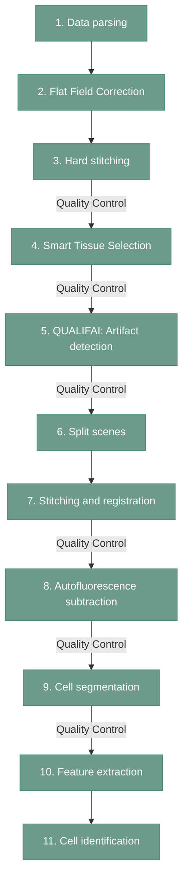
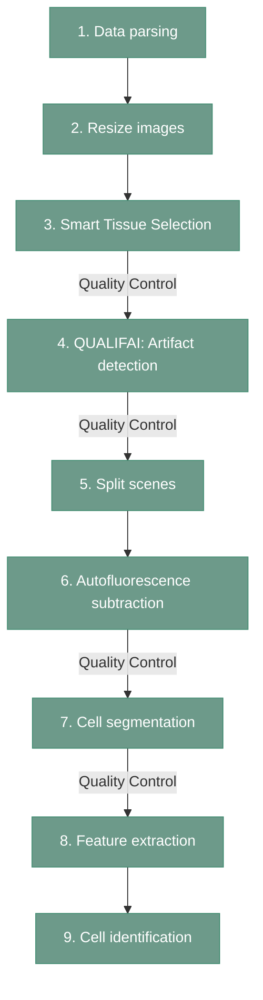
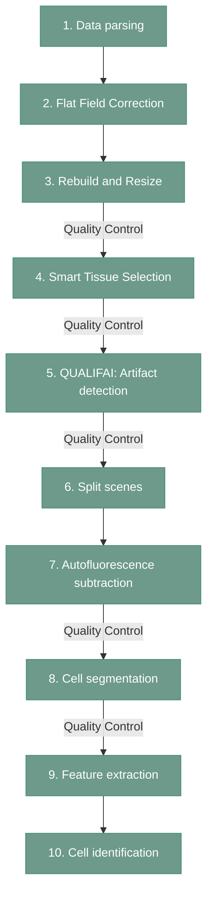

# DISSCOvery

DISSCOvery is prepared to analyze the data coming from MILAN, LunaPhore (COMET) or Akoya (PhenoCycler). Its pipeline prepares the data coming from each of the platform in similar, though not identicial way.
Especially the first steps differs between the technologies, depending on the platform of choice.
Some steps are not self-contained and use the scripts related to other steps, or required re-running some modules.

## MILAN

Image analysis for MILAN is the most complex one, since it requires both Flat Field Correction and Registration of the images. 
The graph below summarizes all pipeline processes required by MILAN. 
"Quality Control" label marks the points where teh data output should be control and corrected if needed by the user before moving to the next step. 

More information about each module for MILAN can be found here:

[1. Data parsing](https://antoranzlab.github.io/DISSCOvery/01_MILAN_parser/)

[2. Flat Field Correction](https://antoranzlab.github.io/DISSCOvery/02_FFC/)

[3. Hard stitching](https://antoranzlab.github.io/DISSCOvery/03_hard_stitching_MILAN/)

[4. Smart Tissue Selection](https://antoranzlab.github.io/DISSCOvery/04_sts_MILAN/)

[5. QUALIFAI: Artifact detection](https://antoranzlab.github.io/DISSCOvery/05_QUALIFAI/)

[6. Split scenes](https://antoranzlab.github.io/DISSCOvery/06_split_scenes_MILAN/)

[7. Stitching and registration](https://antoranzlab.github.io/DISSCOvery/07_registration/)

[8. Autofluorescence subtraction](https://antoranzlab.github.io/DISSCOvery/08_AFS/)

[9. Cell segmentation](https://antoranzlab.github.io/DISSCOvery/09_segmentation/)

[10. Feature extraction](https://antoranzlab.github.io/DISSCOvery/10_feature_extraction/)

[11. Cell identification Part 1](https://antoranzlab.github.io/DISSCOvery/11_cell_identification1/) & [11. Cell identification Part 2](https://antoranzlab.github.io/DISSCOvery/11_cell_identification2/)

## COMET

Comet image preprocesssing is the simplest one out of all three available technologies, since the scanner conduct registration and flat field correction already. 
The graph below summarizes all pipeline processes required by COMET. 
"Quality Control" label marks the points where teh data output should be control and corrected if need by the user before moving to the next step. 

More information about each module for COMET can be found here:

[1. Data parsing](https://antoranzlab.github.io/DISSCOvery/01_COMET_parser/)

[2. Resize images](https://antoranzlab.github.io/DISSCOvery/03_hard_stitching_COMET/)

[3. Smart Tissue Selection](https://antoranzlab.github.io/DISSCOvery/04_sts_COMET/)

[4. QUALIFAI: Artifact detection](https://antoranzlab.github.io/DISSCOvery/05_QUALIFAI/)

[5. Split scenes](https://antoranzlab.github.io/DISSCOvery/06_split_scenes_COMET_AKOYA/)

[6. Autofluorescence subtraction](https://antoranzlab.github.io/DISSCOvery/08_AFS/)

[7. Cell segmentation](https://antoranzlab.github.io/DISSCOvery/09_segmentation/)

[8. Feature extraction](https://antoranzlab.github.io/DISSCOvery/10_feature_extraction/)

[9. Cell identification Part 1](https://antoranzlab.github.io/DISSCOvery/11_cell_identification1/) & [11. Cell identification Part 2](https://antoranzlab.github.io/DISSCOvery/11_cell_identification2/)

## AKOYA

Images from AKOYA are already stitched, however the flat field correction is still required. 
Therefore, teh complexity of image preprocessing for AKOAY falls between COMET and MILAN

More information about each module for AKOYA can be found here:

[1. Data parsing](https://antoranzlab.github.io/DISSCOvery/01_AKOYA_parser/)

[2. Flat Field Correction](https://antoranzlab.github.io/DISSCOvery/02_FFC/)

[3. Rebuild and Resize](https://antoranzlab.github.io/DISSCOvery/03_hard_stitching_AKOYA/)

[3. Smart Tissue Selection](https://antoranzlab.github.io/DISSCOvery/04_sts_AKOYA/)

[4. QUALIFAI: Artifact detection](https://antoranzlab.github.io/DISSCOvery/05_QUALIFAI/)

[5. Split scenes](https://antoranzlab.github.io/DISSCOvery/06_split_scenes_COMET_AKOYA/)

[6. Autofluorescence subtraction](https://antoranzlab.github.io/DISSCOvery/08_AFS/)

[7. Cell segmentation](https://antoranzlab.github.io/DISSCOvery/09_segmentation/)

[8. Feature extraction](https://antoranzlab.github.io/DISSCOvery/10_feature_extraction/)

[9. Cell identification Part 1](https://antoranzlab.github.io/DISSCOvery/11_cell_identification1/) & [11. Cell identification Part 2](https://antoranzlab.github.io/DISSCOvery/11_cell_identification2/)

