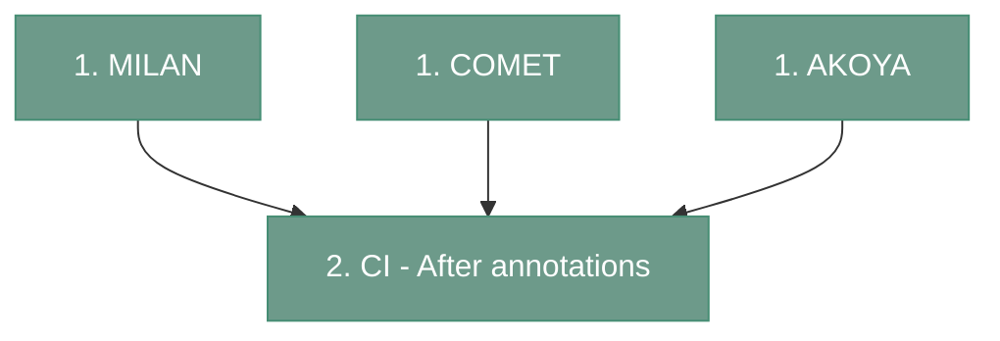

# Snakemake 

---

## Disclaimer before running the snakemake
DISSCOvery is a complex pipeline containing many scripts. To make manual execution more accessible, we prepared four Snakemake pipelines.

However, a downside of using Snakemake pipelines is the lack of human intervention during the analysis. 
Consequently, quality control steps may not be performed, which can affect the final results. 
In the worst-case scenario, the Snakemake pipeline may fail to complete if the quality of the intermediate outputs is insufficient. 
The quality control points are illustrated [here](https://antoranzlab.github.io/DISSCOvery/main/).

---

## Overview
Since the image preprocessing differs among available technologies each of them has a designated snakemake file. 
In the final step, cell identification, the output has the same format for all possible input data type. 
Therefore, for all three technolgies the main image preociessing snakemake finshes at generating the annotation dictionary. 
This is equaivalent of running all script manually until the end of [Cell identification - Part 1](https://antoranzlab.github.io/DISSCOvery/11_cell_identification1/)
This file has to be annotated by the user before moving to final snakemake called "CI - After annotations". 
More information about annotating is located in the [description of this part of the pipeline](https://antoranzlab.github.io/DISSCOvery/11_cell_identification1/#script-9-clusters-annotation).
To conclude, to run full pipeline, user has to run two snakemakes, one technology specific and one after annotations. 

<div align="center">


</div>

---

## Setting up the environment
In order to ensure reproducibility, the environment is [dockerized](https://hub.docker.com/r/augpath/disscovery_backend/tags), To set up the environment pass

```
docker pull augpath/disscovery_backend:latest
```
You can check if the image was properly installed with  

```
docker image ls
```

Clone the repository

```
git clone https://github.com/antoranzlab/DISSCOvery.git
cd ./DISSCOvery
```

Since each snakemake requires adjusting the config file, it's necessary to mount the docker to three local directories: 
1. directory with your input data
2. directory where snakemake will write the output (project directory)
3. path to `./DISSCOvery` folder

```
docker run -it -v /path_to_input_data/:/path_to_input_data/ -v /path_to_output/:/path_to_output/ -v your_path/DISSCOvery/:your_path/DISSCOvery/ augpath/disscovery_backend:latest
```

---

## Snakemake MILAN

Snakemake for MILAN covers all pipeline steps starting from [Data Parsing](https://antoranzlab.github.io/DISSCOvery/01_MILAN_parser/) and finishing at [Cell identification - Part 1](https://antoranzlab.github.io/DISSCOvery/11_cell_identification1/).


### Preparing configuration file

Enter the `MILAN` subfolder in the `DISSCOvery` folder.

```
cd ./DISSCOvery/MILAN/
```

There are two files located in this directory. The `Snakefile`, that describes all rules that snakemake will execute, and `config.yaml`. 

Open the `config.yaml`. At the top, in the 'Master variables' section you need to adjust the variables tro your needs. 

```
# ---- Master variables  ----
base_input_dir: "your_path/MILAN_input_data" # Path to the MILAN czi data
base_output_dir: "your_path/output" # Path where output will be created
project_name: "test_MILAN" # Name of the project
scripts: "your_path/DISSCOvery" # Path to DISSCovery folder
exp_design_rounds: 'your_path/MILAN_exp_design_prepared/exp_design_rounds.csv' # Path to exp_design_rounds.csv
seed: '1234'
ref_round: "R01" # Reference round used for FFC, STS, AlignQC and segmentation
ref_version: "V01" # Reference version used for FFC, and STS
phenotypic_markers_list: ['PD1', 'CD4', 'CD8'] # Marker list for 11 Cell identification Part 1 (1st level clustering)

reference_map: # Refernece map used for split scenes
  test: # replace 'test' with your slide name
    reference_round: "R01" # replace with your reference round number
    reference_version: "V01"
```
This is the minimum configuration that must be done to run the MILAN snakemake.

`base_input_dir`
: Path to the directory containing the raw MILAN .czi input data. Example: `your_path/MILAN_input_data`

The MILAN raw data must be located in one folder, with rounds organized as follows:

```
MILAN_input_data/
├── R01/
│   ├── image_01.czi
│   ├── image_02.czi
│   └── ...
├── R02/
│   ├── image_01.czi
│   ├── image_02.czi
│   └── ...
├── R03/
│   ├── image_01.czi
│   ├── image_02.czi
│   └── ...
├── R04/
│   ├── image_01.czi
│   └── ...
└── R05/
    ├── image_01.czi
    └── ...
```

`base_output_dir`
: Path to the directory where all pipeline output files will be created. Example: `your_path/output`

`project_name`
: Name of the MILAN analysis project. This is used to organize and identify the generated results. Example: `test_MILAN`

`scripts`
: Path to the DISSCOvery directory containing the pipeline scripts and resources. Example: `your_path/DISSCOvery`

`exp_design_rounds`
: Path to the experimental design file defining the experimental rounds used in the analysis. Example: `your_path/MILAN_exp_design_prepared/exp_design_rounds.csv`

`seed`
: Random seed used to make stochastic analysis steps reproducible. Example: `1234`

`ref_round`
: Reference experimental round used for flat-field correction (FFC), STS, AlignQC, and cell segmentation. Example: `R01`

`ref_version`
: Reference version used for flat-field correction (FFC) and STS processing. Example: `V01`

`phenotypic_markers_list`
: List of protein markers used for the first-level cell identification and clustering analysis. These markers are used to characterize and distinguish cell populations. Example: `['PD1', 'CD4', 'CD8']`

`test`
: Name of the slide for which the reference map is defined. Replace `test` with the corresponding slide name.

`reference_round`
: Reference experimental round used as the reference for scene mapping. Example: `R01`

`reference_version`
: Reference version within the selected round used for scene mapping. Example: `V01`


If you want to personalize the other configuration variables check the [MILAN backend description](https://antoranzlab.github.io/DISSCOvery/01_MILAN_parser/01_MILAN_parser/)

### Running snakemake MILAN

After editing the `config.yaml`, while still located in the `./DISCOvery/MILAN` subfolder, pass the command

```
snakemake --cores 2
```

Use the number of cores that suits your need. 

!!! warning
    Don't assign too much cores for snakemake. Some of the scripts occupy more cores individually to generate the output. 
If you assign 4 cores to Snakemake and it executes 4 jobs in parallel, with each job using 10 cores, you may run into resource constraints.

You can also use the dry run to check if snakemake recognizes the files and to see the planned actions with 
```
snakemake -n -p
```

---

## Snakemake COMET

Snakemake for COMET covers all pipeline steps starting from [Data Parsing](https://antoranzlab.github.io/DISSCOvery/01_COMET_parser/) and finishing at [Cell identification - Part 1](https://antoranzlab.github.io/DISSCOvery/11_cell_identification1/).

### Preparing configuration file

Enter the `COMET` subfolder in the `DISSCOvery` folder.

```
cd ./DISSCOvery/COMET/
```

There are two files located in this directory. The `Snakefile`, that describes all rules that snakemake will execute, and `config.yaml`. 

Open the `config.yaml`. At the top, in the 'Master variables' section you need to adjust the variables tro your needs. 

```
# ---- Master variables  ----
base_input_dir: "your_path/COMET_input_data"  # Path to the COMET input data
base_output_dir: "your_path/output" # Path where output will be created
project_name: "test_COMET" # Name of the project
scripts: "your_path/DISSCOvery" # Path to DISSCovery folder
seed: '1234'
slide_id: 'test'
user_id: 'AB'
project_id: 'CD'
phenotypic_markers_list: ['FOXP3', 'TIM3', 'CD56'] # Marker list for 11 Cell identification Part 1 (1st level clustering)
reference_round: "R01" # Reference round used globally

reference_map: # Refernece map used for split scenes
  test: # replace 'test' with your slide name
    reference_round: "R01" # replace with your reference round number
    reference_version: "V01"
```
This is the minimum configuration that must be done to run the COMET snakemake.


`base_input_dir`
: Path to the directory containing the raw COMET input data. Example: `your_path/COMET_input_data`

`base_output_dir`
: Path to the directory where all pipeline output files will be created. Example: `your_path/output`

`project_name`
: Name of the COMET analysis project. It is used to organize and identify the generated results. Example: `test_COMET`

`scripts`
: Path to the DISSCOvery directory containing the pipeline scripts and resources. Example: `your_path/DISSCOvery`

`seed`
: Random seed used to make stochastic analysis steps reproducible. Example: `1234`

`slide_id`
: Identifier of the slide being processed. Example: `test`

`user_id`
: Identifier of the user or researcher associated with the analysis. Example: `AB`

`project_id`
: Identifier of the project associated with the analysis. Example: `CD`

`phenotypic_markers_list`
: List of protein markers used for the first-level cell identification and clustering analysis. These markers are used to characterize and distinguish cell populations. Example: `['FOXP3', 'TIM3', 'CD56']`

`reference_round`
: Global reference experimental round used as the reference for processing and alignment steps throughout the pipeline. Example: `R01`


`reference_map: test`
: Name of the slide for which the reference map is defined. Replace test with the corresponding slide name. Example: `test`

`reference_map: reference_round`
: Reference experimental round used for scene mapping for the specified slide. Example: `R01`

`reference_map: reference_version`
: Reference version within the selected round used for scene mapping. Example: `V01`

If you want to personalize the other configuration variables check the [COMET backend description](https://antoranzlab.github.io/DISSCOvery/01_COMET_parser/01_COMET_parser/)

### Running snakemake COMET

After editing the `config.yaml`, while still located in the `./DISCOvery/COMET` subfolder, pass the command

```
snakemake --cores 2
```

Use the number of cores that suits your need. 

!!! warning
    Don't assign too much cores for snakemake. Some of the scripts occupy more cores individually to generate the output. 
If you assign 4 cores to Snakemake and it executes 4 jobs in parallel, with each job using 10 cores, you may run into resource constraints.

You can also use the dry run to check if snakemake recognizes the files and to see the planned actions with 

```
snakemake -n -p
```

---

## Snakemake AKOYA

Snakemake for AKOYA covers all pipeline steps starting from [Data Parsing](https://antoranzlab.github.io/DISSCOvery/01_AKOYA_parser/) and finishing at [Cell identification - Part 1](https://antoranzlab.github.io/DISSCOvery/11_cell_identification1/).


### Preparing configuration file

Enter the `AKOYA` subfolder in the `DISSCOvery` folder.

```
cd ./DISSCOvery/AKOYA/
```

There are two files located in this directory. The `Snakefile`, that describes all rules that snakemake will execute, and `config.yaml`. 

Open the `config.yaml`. At the top, in the 'Master variables' section you need to adjust the variables tro your needs. 

```
# ---- Master variables  ----
base_input_dir: "your_path/AKOYA_input_data" # Path to the COMET input data
base_output_dir: "your_path/output" # Path where output will be created
project_name: "test_AKOYA" # Name of the project
scripts: "your_path/DISSCOvery" # Path to DISSCovery folder
seed: '1234'
slide_id: 'test'
user_id: 'KN'
project_id: 'BM'
phenotypic_markers_list: ['FOXP3', 'TIM3', 'CD56'] # Marker list for 11 Cell identification Part 1 (1st level clustering)
reference_round: "R01" # Reference round used globally

reference_map: # Refernece map used for split scenes
  test: # replace 'test' with your slide name
    reference_round: "R01" # replace with your reference round number
    reference_version: "V01"
```

This is the minimum configuration that must be done to run the AKOYA snakemake.

`base_input_dir`
: Path to the directory containing the raw AKOYA input data. Example: `your_path/AKOYA_input_data`

`base_output_dir`
: Path to the directory where all pipeline output files will be created. Example: `your_path/output`

`project_name`
: Name of the AKOYA analysis project. It is used to organize and identify the generated results. Example: `test_AKOYA`

`scripts`
: Path to the DISSCOvery directory containing the pipeline scripts and resources. Example: `your_path/DISSCOvery`

`seed`
: Random seed used to make stochastic analysis steps reproducible. Example: `1234`

`slide_id`
: Identifier of the slide being processed. This should correspond to the slide name used in the input data and configuration. Example: `test`

`user_id`
: Identifier of the user or researcher associated with the analysis. Example: `AB`

`project_id`
: Identifier of the project associated with the analysis. Example: `CD`

`phenotypic_markers_list`
: List of protein markers used for the first-level cell identification and clustering analysis. These markers are used to characterize and distinguish cell populations. Example: `['FOXP3', 'TIM3', 'CD56']`

`reference_round`
: Global reference experimental round used as the reference for processing and alignment steps throughout the pipeline. Example: `R01`

`reference_map: test`
: Name of the slide for which the reference map is defined. Replace test with the corresponding slide name. Example: `test`

`reference_map: reference_round`
: Reference experimental round used for scene mapping for the specified slide. Example: `R01`

`reference_map: reference_version`
: Reference version within the selected round used for scene mapping. Example: `V01`

If you want to personalize the other configuration variables check the [AKOYA backend description](https://antoranzlab.github.io/DISSCOvery/01_AKOYA_parser/01_AKOYA_parser/)

### Running snakemake AKOYA

After editing the `config.yaml`, while still located in the `./DISCOvery/AKOYA` subfolder, pass the command

```
snakemake --cores 2
```

Use the number of cores that suits your need. 

!!! warning
    Don't assign too much cores for snakemake. Some of the scripts occupy more cores individually to generate the output. 
If you assign 4 cores to Snakemake and it executes 4 jobs in parallel, with each job using 10 cores, you may run into resource constraints.

You can also use the dry run to check if snakemake recognizes the files and to see the planned actions with 

```
snakemake -n -p
```

---

## Snakemake - Finishing the pipeline after cluster annotation

This part is mutual for all technologies. It covers the last pipeline step [Cell identification - Part 2](https://antoranzlab.github.io/DISSCOvery/11_cell_identification2/). 

!!! info
    Before executing this part of the pipeline make sure that the `annotation_dictionary.csv`, located in `your_output_path/project_name/output_cell_identification/n01/v01/` has been annotated

### Preparing configuration file

Enter the `After_annotatons` subfolder in the `DISSCOvery` folder.

```
cd ./DISSCOvery/After_annotatons/
```

There are two files located in this directory. The `Snakefile`, that describes all rules that snakemake will execute, and `config.yaml`. 

Open the `config.yaml`. At the top, in the 'Master variables' section you need to adjust the variables to your needs. 
Master variables repeats some of the information provided in the `config.yaml` used in first part of the image preprocessing. 
The paths and marker list should stay consistent between these two config files. 

```
# ---- Master variables  ----
base_output_dir: "your_path/output" # Path where output will be created
project_name: "test_MILAN" # Name of the project
scripts: "your_path/DISSCOvery" # Path to DISSCovery folder
seed: '1234'
phenotypic_markers_list: ['PD1', 'CD4', 'CD8'] # markers for 1st level clustering
```

This is the minimum configuration that must be done to run this snakemake.

`base_output_dir`
: Path to the directory where all pipeline output files will be created. Example: `your_path/output`

`project_name`
: Name of the AKOYA analysis project. It is used to organize and identify the generated results. Example: `test_MILAN`

`scripts`
: Path to the DISSCOvery directory containing the pipeline scripts and resources. Example: `your_path/DISSCOvery`

`seed`
: Random seed used to make stochastic analysis steps reproducible. Example: `1234`

`phenotypic_markers_list`
: List of protein markers used for the first-level cell identification and clustering analysis. These markers are used to characterize and distinguish cell populations. Example: `['FOXP3', 'TIM3', 'CD56']`


If you want to personalize the other configuration variables check the [Cell identification - Part 2](https://antoranzlab.github.io/DISSCOvery/11_cell_identification2/)

### Running snakemake to finish the pipeline

After editing the `config.yaml`, while still located in the `./DISCOvery/After_annotatons` subfolder, pass the command

```
snakemake --cores 2
```

Use the number of cores that suits your need. 

!!! warning
    Don't assign too much cores for snakemake. Some of the scripts occupy more cores individually to generate the output. 
If you assign 4 cores to Snakemake and it executes 4 jobs in parallel, with each job using 10 cores, you may run into resource constraints.

You can also use the dry run to check if snakemake recognizes the files and to see the planned actions with 

```
snakemake -n -p
```

---